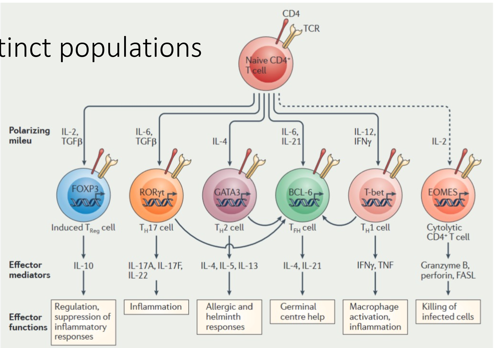
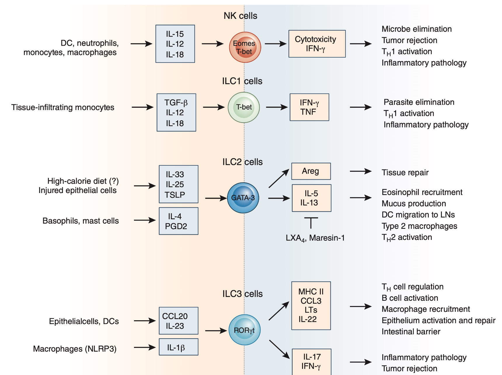
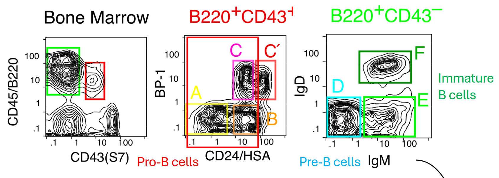
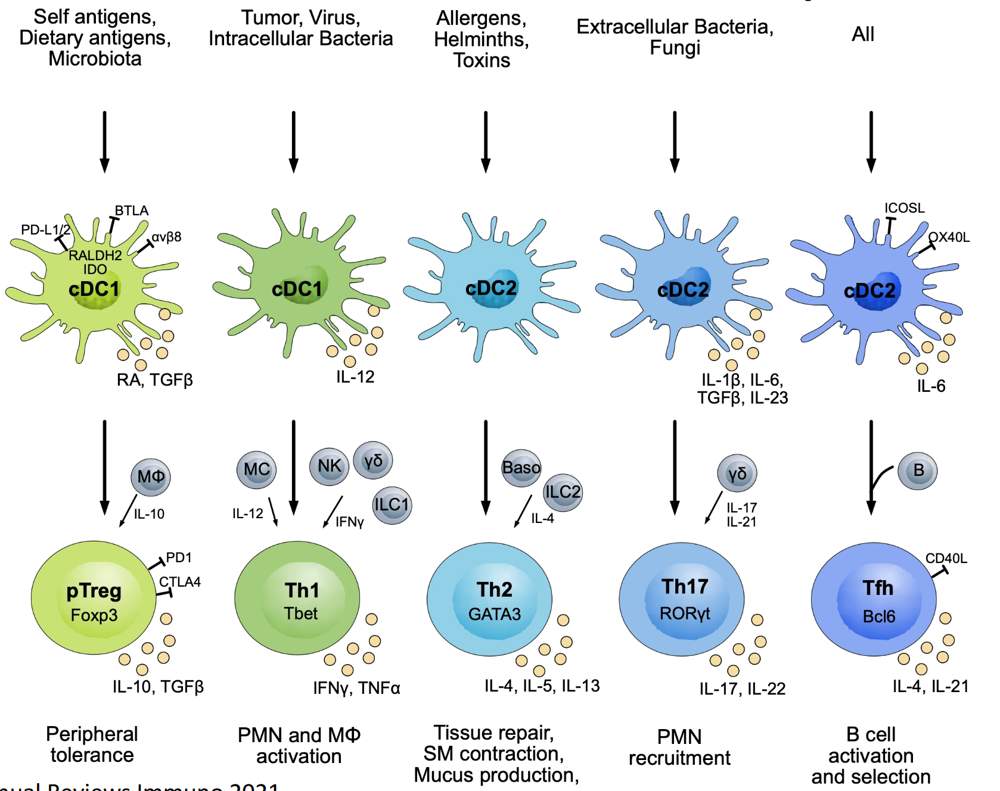
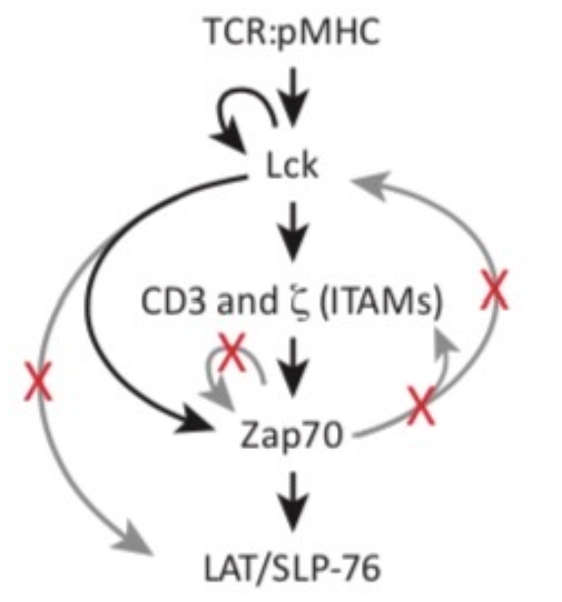

- Lecture 1 Anatomy of the Immune System - Ulrich von Andrian
  collapsed:: true
	- Microcirculation never has turbulent flow
		- this feels important actually
	- Neutrophils and other immune cells in microcirculation have crazy high wall shear stress
		- 0.5-40 dyn/cm^2
		- They're moving around at 2mm/s
			- That's equivalent to moving at like 350 times your radius every second
			- Crazy fast
	- They have to stop not only very quickly but also stop under a crazy flow
	- interactions happen on the order of milliseconds and have to be strong enough
	- Nothing ever leaves from the arteries or capillaries, it's all from the veins
		- Ashley Moseman video of LysM GFP mouse showing neutrophils only at the venule
		- Different endothelial cells
		- DARC expressing venules
	- Almost universally true
		- Except in places where blood flow is weird like the liver, lung, spleen, kidney glomerulus
	- Extravasation happens by chance for first meeting
		- Starts rolling with soft-ish attachment
		- Activation signal leads to actual exit
			- chemokine receptor or other things but usually GPCR
		- Main factors
			- Selectins on both ends
				- L on leukocyte (CD62L)
				- P (platelet) and E (endothelial) on endothelial
				- Recognize sialomucins
					- glycosylated sugar display
				- This does the tethering
					- rolling interaction that binds but can let go
					- always active
			- Integrins on leukocytes
				- \alpha4\beta7 and other ones
				- Bing to IgSF on endothelial
					- immunoglobulin superfamily
					- MadCAM
					- VCAM
				- \beta2 binds to ICAMs
					- this is important for arrest
					- CD18
				- integrins change their conformation following activation signal
					- activation dependent to do the arrest
					- not always active and very strong
		- Multi step cascade
			- Primary adhesion receptor (Endothelial ligand)
				- 8 pathways
			- Chemoattractant receptor (Activating signal)
				- \>50 pathways
				- There's a lot of ways of doing this
			- Secondary activation dependent receptor (Endothelial ligand)
				- 5 pathways
	- IL1 and other inflammatory signals upregulate P and E selectins
	- arachanoid acid metabolite LTB4 is a potent chemoattractant
	- How do you have a segmented environmental signal that determines what is a venule?
	- Distinct expression profiles in different organs to have a homing
		- vascular addressins in the multi step adhesion cascade
	- Tissues have specific combinations of surface markers
		- Antigen presentation in secondary lymphoid organ does imprinting
		- get a roadmap
	- Each antigenic protein gets fragmented into many peptides
		- Can get many clones for each protein
		- Large pool of TCR to start with
	- Each T cell variant has only around 6000 copies - how does it find it's antigen? same for B cell
	- Secondary lymphoid organs are lymphoid parties
		- Spleen is blood borne antigens
		- Peyer's patches in small intestine
			- hand antigen over to DC that goes and presents
		- Peripheral lymph nodes to meet and greet
			- T and B cells hone here and then go and sample a lot of APCs
	- Lymph nodes
		- functional at steady state
			- DCs take up material and present in MHC
				- but at steady state don't have cytokines and don't have costimulatory factors
			- This sets up tolerance
				- "normal" antigens
		- Lymphocytes hone to lymph nodes
			- High endothelial venules (HEV) except spleen
				- PNAd (MECA-79 antigen) Peripheral node addresin
					- O-linked silomucin
					- ligand for CD62L
				- very specific to the cortex of the node
			- L-selectin (CD62L) to bind to PNAd and start rolling
			- Activation signal is CCL21 interacting with CCR7
				- Neutrophils don't have this so they don't enter lymph nodes
			- LFA-1 (CD11a/CD18) integrin to exit
		- During inflammation
			- DCs mature so there's more of them and they have costim and cytokines
			- Once DC finds the corresponding T cell it does clonal proliferation
		- Activated T cell leaves lymph nodes and goes to inflammatory venule
			- does the multi-step adhesion cascade there
				- Effector T cells lose L-selectin and CCR7 so they no longer hone to lymph nodes
			- short lived
		- memory cells
			- tissue resident and central
		- Separation of B and T cell areas
			- B cells go to outer cortex
				- They express CXCR5 (CXCL13 ligand)
					- ligand made by stromal cells in the B cell follicle
			- T cell area in the medulla
				- activated T cell that becomes a follicular helper cell upregulates CXCR5
		- How do cells leave a lymph node?
			- Sphingosine 1-phosphate build up functions as a timer
			- Build up of S1P leads to exit into efferent lymphatic
	- Antigen presentation in lymph node
		- Migratory DC
		- Three phases of antigen presentation
			- brief serial encounters
				- highly motile, sampling many DCs
				- activation factors are being upregulated
				- During of this is dependent on the amount of antigen presented by the DC
			- stable contacts
				- find your partner
				- start making cytokine (IL2 / IFN\gamma)
				- required for memory
					- continued exposure to antigen
			- brief serial encounters
				- proliferation starts
	- Tregs can make TGB\beta to suppress immune response of Cytotoxic T Lymphocyte
	- Solid tumors do not have functional venules
		- vasculature is basically just pipes, there's no functional thing for the T cells to attach to
	- Memory cells
		- There's several subsets that have different migratory properties and different lifespans
		- Guidelines for T cell nomenclature nature reviews immunology
		- CX3CR1 (fractalkine receptor)
			- this is normally a monocyte / macrophage marker, but CD3+ T cells get it later in infection
			- naive T cells are negative, only starts turning on day 6 post exposure
		- Spectrum of activation
			- Negative cells are proliferative - progenitor
				- central memory pool
			- Middle do some homeostatic proliferation
				- kind of a stem cell population? asymmetric division
				- can hone into lymphoid and non-lymphoid tissue
			- Positive are effectors
				- intravascular patrolling
				- This is weird
				- go upstream
				- TCR driven red actin co-expressing CX3CR1 so it looks like a non-classical monocyte but it's a T cell
					- OT-1 CD8 T cells
		- Shape immune memory of activation with imprinting
		- Tissue resident memory cells can turn on CXCL9 to recruit CXCR3 which is on all T cells
	- B cells
		- B cells are in the cortex where they interact with macrophages
		- CD169+ macrophages take up virus coming in from lymphatics and hold them on their surface
			- Basically just hold up the virus (antigen) to the B cells
		- After activation from the macrophage
			- upregulate CCR7 to go to the other side of the lymph node and find CD4 Th
	- As soon as the animal dies physiology stops
		- The cells aren't dead but hypoxia makes them completely change shape and motility
		- Keeping at 37C is very important too
- Lecture 2 Immune Response to Viruses - Sara Cherry
  collapsed:: true
	- Every organism has an innate immune system
		- genetically encoded
		- Pattern recognition (PAMP/DAMP/TLR)
	- "Higher" organisms have an acquired immune system
		- RAG dependent
	- Barriers in each anatomical location
		- Distinct barriers have specializations and there's specific pathogens that are able to go through each
	- Pattern Recognition Receptors
		- TLR
		- NLR
		- cGAS
		- RIG-I
		- Pathogen Associated Molecular Patterns
			- LPS
			- viral nucleic acids, glycoproteins
			- combinatorial effectors to be a pathogen
				- LPS on commensals is nbd
	- Viruses are obligate intracellular pathogens
		- Virions are extracellular but the genomic compartments are cytoplasmic
		- Compartmentalization of functions throughout replication cycle
		- Mostly sensed by recognition of nucleic acids
			- viral RNA and DNA are very different than mammalian
			- RNA sensing
				- dsRNA intermediates
					- RIG-I
					- PKR
						- eIF2a downstream that shuts down translation
					- OAS3
						- activates RNase L to degrade all RNA in the cell
						- makes a 5mer of adenosine that makes a dimer of RNase L
				- 5' end
					- tri phosphate is not the same as 5' guanine capping for normal RNA
				- Stem loops
			- DNA sensing
				- Cytosolic DNA
					- Trex1 exonuclease is constitutively expressed at low levels to suppress normal DNA leakage
					- cGAS
						- DNA sensor (no sequence specificity)
						- makes cGAMP that binds to STING
				- Rolling circle amplification / other replication intermediates
			- cGAS and OAS are in the same family and there's other members
				- highly conserved
	- Toll like receptors do both
		- Glycoproteins
		- large family (13?)
	- Self non-self recognition
		- There's physiological PAMPs that are normal
		- ncRNA has weird caps, can be double stranded (ribosome)
		- retro elements
			- ADAR1 tries to minimize double stranded Alu elements
	- Interferon is epic at starting anti-viral response
		- Jak/STAT signaling through IFNAR activating ISGS
		- increase MHC1 expression
		- Strengthen NK to kill viral infected cells
		- Classic effectors
			- PKR, OAS, and Mx proteins
		- ISGS
			- different ones targeting every step of virus life cycle
	- Many types of interferon
		- all work through Jak / stat signaling but not the same ones
		- faster interferon response is better at clearing infection
		- Type 1
			- 13 genes in human, \alpha, \beta, \kappa, \delta, \tau
			- made by any cell
			- systemic
		- Type 2
			- IFN\gamma
			- lymphocytes and myeloid cells
		- Type 3
			- barrier tissues
				- epithelial, endothelial, placenta, skin, lung
				- very important in GI
			- \lambda, 3 types
			- Less toxic, not as elevated immune response
			- local
	- Initial response
		- barrier epithelial tissues start secreting cytokines like IFN, PAMPs, DAMPs
		- innate immune cells
			- Macrophages express the PRRs to get to the site of infection
				- go into M1 phenotype and do all the pro-inflammatory stuff
			- plasmacytoid dendritic cells are type 1 IFN factories
				- migrate to lymph node to get adaptive immunity help
			- NK look for downregulated MHC class 1
	- Antigen presenting cells
		- MHC class 1 is on all nucleated cells
			- presentation of cytoplasmic protein fragments
		- MHC class 2 expressed on APC
			- presentation of external antigen, binds to TCR
			- cross dressing
		- HLA locus is the most polymorphic locus in humans
			- alleles have differential pathogenic protection
	- T cell activation
		- MHC 2, co stimulation, cytokines
		- dependent on the integration of these things you get different kinds of effector T cell
			- 
			- CD4 t cells can also directly kill (EOMES positive)
		- CD8 is the fr CTL
	- B cells
		- there's different Fc
			- that bind to different Fc receptors
				- CD64, CD32(a/b/c), CD16(a/b)
			- avidity, affinity, functions can all be different
- Lecture 3 ILC and NK cells - Wayne Yokoyama
  collapsed:: true
	- ILC is mostly the equivalent of Th cells that do not require antigen presentation to mature
		- derived from common lymphoid progenitor
		- No RAG dependence
	- NK is CTL equivalent
	- Cytokine responsive to get specific subsets (expand to get figure)
	  collapsed:: true
		- 
	- ILC progenitors are kind of complicated
		- HSC -> Common Lymphoid Progenitor
		- NK cells diverge from the next step which is EILP
			- early innate lymphocyte progenitor
				- TCF-1 positive, \alpha4\beta7 integrin
			- requires EOMES
		- ILCs are plastic
			- T and B cells are fixed because they're typified by their T or B cell receptors
			- But ILC doesn't have that so they can switch types
				- NK -> ILC1 (cytotoxic to not cytotoxic)
				- ILC3 -> ILC1 (IL22 -> IFN\gamma switch)
				- in tumor environment, parasite infection, etc
	- Functions
		- lots of things going on in the lung and intestine
		- extremely busy slide to the point of useless
		- Tissue resident
			- for the most part do not circulate
			- tissue specific distribution
		- Particularly important for mucosal areas
	- NK basic biology and functions
		- Part of the ILC family
		- Do not use VDJ recombination
		- Important for viral defense, named for "natural killing" of tumors
		- Been hard to find a marker or single defining feature
			- NK1.1+, CD3\epsilon- in B6
				- there's also NK1.1+ CD3\epsilon+ cells that are T cells (NKT cells)
			- No functional marker
				- KO of NK1.1 still has functional NK cells
		- Circulate
		- NK deficiencies
			- IL15 KO mouse
				- this is sensitive, any of the three chains being absent is bad (\alpha \beta \gamma)
				- Also if downstream JAK1/3 STAT5 -> no NK
			- Eomes KO
			- Ncr1 Cre mouse is a cre driver for NK cells
		- Cell Responses and Effector mechanisms
			- cytotoxic
				- Spontaneous killing by degranulation
				- very similar to CTL lysis mechanism
					- no role for Fas/FasL
					- They can also use Fas later, but first steps are independent
					- same mechanism of granule exocytosis
				- Detection of degranulation with CD107a assay
			- responsive to IL12, 15, 18 to produce IFN\gamma
				- also chemokines like MIP-1\alpha
			- YAC-1 target stimulates to kill
		- Antibody dependent cellular cytotoxicity ADCC
			- NK constitutively express CD16 (Fc\gamma\R3)
			- binds to antibody to stimulate degranulation
			- there's also reverse ADCC
				- Target expresses Fc receptor that binds antibody binding to NK cell
				- You bind to something that sees me? You die
	- Missing-self and Target Recognition
		- NK attacks cells that are missing MHC class 1 because of virus downregulation
			- CTLs require MHC class 1 viral protein demonstration
			- T cell detects non-self
			- NK detects lack of self
		- works through inhibitory and activation receptors
			- Ly49A recognizes H2D^d
				- inhibitory receptors have ITIMs (immunoreceptor Tyr-based inhibitory motifs)
			- MCMV infection downregulates MHC, but can also display m157
				- this binds with Ly49H which triggers degranulation
				- activation receptors don't have
					- dimerize for activity
					- associate with ITAM containing partner
			- Ig like receptors in human
				- expressed on some other cells
				- some complicated stuff here, as always
			- C type lectin receptors in mouse
				- disulfide linked homodimer
		- mouse and human are close but they have different receptors
			- convergent evolution
			- Ly49 in mouse, KIR in human
			- function is mostly the same
		- T cells have one receptor for their antigen but NK express multiple
			- and there's subsets of NK cells that express different ones
	- NK receptor polymorphism
		- Two major groups of haplotypes in humans
		- diseases associated with haplotype mismatch
		- NK dependent mechanism is unclear
	- Tolerance
		- MHC 1 deficient mice do not have overactive NK cells
			- actually it's the opposite
			- don't make IFN\gamma if no MHC
		- NK cells can reject bone marrow grafts with matched HLA (hybrid resistance)
		- need licensing to get any killing activity
			- pre filter? Kind of like an activation? not sure I understand
	- memory NK cells
		- expansion of cells during infection and some of them stay
		- There's some degree of clonal expansion here, so you have some receptor enrichment
		- pre-disposed to respond
	- tissue resident NK
		- different subsets of cells
		- CD49a+ DX5- cells in the liver
			- don't move to the other liver in a parabiosis experiment
		- Gata3+ goes into the thymus
		- these seem to be Eomes independent
			- closer to ILC? some kind of spectrum
			- but actually probably more like they're derived from regular NK cells
				- after TGF\beta stim
	- Adoptive immunotherapy
		- NK can kill the tumors
			- transplanted NK might be more effective?
		- lots of medical interest in this
		- engineered NK with TCR or CAR or other weird things
- Lecture 4 Myeloid Cells in Immune Responses - Claudia Jakubzick
  collapsed:: true
	- Cell types and cell identities and cell states
		- becoming fuzzier as you go down
	- Myeloid cells generally are bridges between innate and adaptive
		- DCs are specifically doing this
	- Markers
		- Macrophage: CD88+ CD26-
			- DC vs macrophage (inverse)
		- CD64+ F4/80+
		- monocytes need CCR2 for migration into tissue
			- other cells express but it's not as necessary
		- DCs turn on CCR7 after activation
			- during migration to lymph node
	- Macrophages and Dendritic cells
		- Macs grind up antigen, DCs save it
			- DCs are specialized for antigen presentation in lymph nodes
			- Macs can also do this, but not as directly optimized for this
		- CD47 (SIRP\alpha receptor) and CD24 (Siglec-10 receptor)
			- don't eat me signals
			- clearance of RBC happening in red pulp of spleen by macrophage
			- Siglec-10 is not specific to CD24
				- more general sialoglycan receptor? something something glycocalyx?
	- clodronate is a very harsh way of getting rid of things
		- cleaner ways exist (what are they? DTA genetics?)
	- Macrophage ontogeny
		- Need of macrophages during development
		- monocytes are 5-10% of pbmc, 20ish hour half life
		- some macrophages are not ever replenished by monocytes
		- selective TFs per organ
		- peritoneal macs express factor V to latch onto things
			- because they're normally zipping around crazy fast
			- extravascular clotting factors
	- Monocytes in steady state
		- circadian rhythm
		- only occupies a niche if it's open?
			- inflammatory state is different because it's actively recruited
		- Can't detect postnatal vs embryonic epigenetic signature?
			- I'm not sure that I believe this?
	- CD206 CD163 for alveolar
	- alveolar macs have large families
		- division of labor within each one
		- tight ratio of cell type numbers
		- gotta look into this with xenium
	- Interstitial macs
		- in basically all tissues, wrap around neurons, blood vessels, lymphatics
		- heavily embedded so they're hard to look at ex vivo
	- Mrc1 = CD206
		- high and low populations
		- unique clusters in interstitial macs have different chemokines rather than growth factors
			- ccl and cxcl differences
		- recruited macs have different growth factors
			- differences in Ocm
			- mac dreived oncostatinM repairs the lung epithelial barrier during inflammatory damage paper
	- Generally macs are always doing something to recruit different immune cells
		- mirror T cell variety
		- recruit B cells to tertiary lymphoid organs
	- Cre sensitivity really matters
		- tdTomato is super sensitive, apparently EYFP lsl is less sensitive
	- Macs have different mmp expression profiles
	- Monocytes can differentiate into DC
	- tlr adjuvants
	- M1 and M2 come from M0
		- recruited cells can change / plastic fate
	- Hidalgo for neutrophils
		- context dependent function, longer lived than expected
	- Myeloid suppressor cells?
		- cell states of monocytes and neutrophils
	-
	- this lady is a crazy lecturer
		- why would you put a claude figure that you say is bad
- Lecture 5 Innate Immunity - Jenny Ting
  collapsed:: true
	- they should change the order of these lectures
		- why are you talking about general innate immunity after the myeloid lecture
	- auto-inflammatory disease is dysregulation of the innate immunity
		- opposed to autoimmunity which is usually adaptive
	- Receptor families
		- Membrane
			- Toll like
			- C-type lectin receptors
		- Intracellular
			- RIG-I like
			- NOD like receptors
				- nucleotide binding leucine rich repeat
			- Aim2 like
			- cGAS-STING
	- PRR pattern recognition receptors
		- PAMP/MAMP/DAMP
		- Pretty broad expression
			- highest on myeloid lineages, but also on epi/endothelial, T/B
		- Sentinels
	- Toll Like Receptors
		- leucine rich repeats in extracellular component
		- intracellular domain is the same TIR domain as in IL-1R
		- Two main groups
			- Membrane - TLR1, 2, 4, 5, 6
				- lipids, lipoproteins, proteins
				- Leucine rich domain, TIR domain intracellular
				- can be homo or hetero dimers (mostly TLR2 hets)
					- TLR1 and 2 hetero
					- TLR2 and 6 hetero
			- Intracellular
				- intracellular membrane vesicles, ER, endosomes, lysosomes
				- homodimers
				- TLR3, 7, 8, 9 nucleic acids
				- TLR10 orphan receptors
				- TLR11-13 don't have functions in humans
		- TIR signaling domain dimerizes for activity
			- downstream adapters Myd88+TIRAP, TRIF+TRAM
			- MAPK pathway going towards NF-\kappa\B or IFN
		- Oxidative response can also be measured by TLR 2, 4, 6
		- Dead and dying cells release nucleic acids that are normally contained
			- Activate TLR7/9 in lysosomes
		- TLR7 has multiple binding sites
	- C-type lectin receptor CLR
		- Ca dependent carbohydrate binding
		- CRD domain (carbohydrate (calcium?) recognition domain)
			- but not all actually require carb or calcium
		- Types of CLR
			- Type 1
				- membrane bound
				- multiple CRD domains or CTLD
			- Type 2
				- membrane bound
				- single CRD domain
			- Type 3
				- soluble oligomeric with lots and lots of domains
			- all clustered on mouse chromosome 6
		- important for cell adhesion, platelets, etc
		- signal through cytoplasmic tail
		- activating and inactivating
	- RIG-I
		- recognizes dsRNA: virus
		- DEAD helicase domain
			- autoinhibitory
			- I guess it destroys the dsRNA so it can't continue activating
		- CARD domain
			- caspase activation and recruitment domain
		- interacts with IPS-1 / MAVS
			- CARD-CARD interactions to activate complex
			- forms filaments / multimers
			- Sun Hur paper
		- MDA5 is related? somehow a bit different
		- LGP-2
			- no CARD domain, works a bit differently
	- NLR Nod-like Receptors
		- NBD-LRR nucleotide binding domain-leucine rich domain
		- large family, 30 in mice 23 in human
		- regulators and checkpoints of immunity
			- Expression of MHC class 1
			- Inflammasome
		- Plants have toooonns of NLRs
			- convergent evolution? or just really old
		- Peptidoglycan specificity
			- Nod1 specific to DAP
			- Nod2 specific to MDP muramyl dipeptide
		- NLR inflammasome
			- lots of NLR proteins that regulate this
			- NLRP3 activated by like everything
			- two stage pathway
				- NF-\kappa\B pathway starts it
					- expression of TNF, IL6, IL12
					- also proIL2, proIL18
				- NLRP3 associates with adaptor molecules
					- recruits and activates pro-caspase1
				- Gasdermin D cleavage
					- pyroptosis
		- Inflammasome
			- IL1\beta and IL18 pro inflammatory cytokines
				- fever, inflammation, influencing IFN\gamma and TH1 function
			- Caspase 1 cleaves the pro forms of the cytokines
				- and cleaves gasdermin D to cause death (pyroptosis) with pore
	- Aim2 like receptors
		- non NLR protein relevant to inflammasome
		- DNA binding receptor that can also make the inflammasome
			- same pro-caspase1 recruitment
			- CARD domain
		- basically the same theme as NLR
	- cGAS STING
		- cyclic GMP-AMP synthase
		- dsDNA receptor, non sequence specific
		- cGAMP activates STING to make IFN\beta
			- makes a STING dimer
		- Type 1 interferon secretion
	- multiple coalescing pathways to make sure that you copy everything
	- TNF is both soluble and membrane
		- TNFR1 and 2 have different functions
		- 1 goes to cell death
			- TRADD (death domain)
		- 2 is TRAF activation for NK-\kappa\B signaling
			- defense against infection
			- cell survival
	- IL6 signaling
		- gp130 receptor scaffold with JAK IL6R
		- Soluble IL6 works differently
		- IL6 autocrine signaling?
- Lecture 6 Molecular and Cellular Regulation of Inflammation - Ivan Zanoni
  collapsed:: true
	- Inflammation evolved to restore tissue homeostasis
		- alteration of the vascular network to deliver blood components to site of infection and injury
		- triggers involve infection, injury, stress
	- Calor, Rubor, Tumor, Dolor
	- Process of inflammation
		- inducers
			- exogenous - microbial derived,
			- endogenous - host derived
		- sensors
			- tissue resident sentinels
		- mediators
			- vasoactive amines / peptides
			- complement
			- lipids (leukotrienes)
			- cytokines
			- chemokines
			- Act within seconds
		- effectors
			- edema
			- plasma mediator systems
				- Triggered by endothelial damage
					- activates Hageman factor
				- kinin
					- Prekallirein -> kalikrein -> convert kininogen to bradykinin
						- smooth muscle contraction
						- Drives pain
				- clotting
					- Hageman factor activates clotting cascade
					- Thrombin cleaves fibrinogen to make fibrin and clot
				- fibrinolytic
					- Plasmin starts degrading the clot to eventually clear
				- complement
					- Self amplifying cascade that gets to a C3 convertase
						- C4aC2a and C3b2B
						- Alternative pathway is always happening but gets shut down on our own cells by factor H
					- C3a and C5a are peptide mediators of inflammation
						- chemoattractant for phagocytes
					- C3b is an opsonizing agent
						- supports recognition of pathogens by phagocytes
					- Downstream C5 convertase and C6 7 8 9 to form membrane attack complex
			- leukocyte recruitment
	- Local vasodilation to increase blood flow and decrease speed - calor and rubor
	- Vascular permeability starts edema (swelling); tumor
	- migration and extravasation of immune cells (neutrophils first)
	- S100a8 specific neutrophil Cre driver
	- Guard theory
		- effector triggered immunity
		- Virulence associated activity
			- not direct sensing of viral / pathogenic components, but rather of "virulence factor"
		- Can help to limit PRR to pathogenic threats rather than commensals
	- Coincident recognition of PAMP and DAMP
		- ways to limit immune response and put on the brakes
		- Simultaneously do pro-inflammatory and anti-inflammatory signaling
			- TNF, IL1, IL6 pro
			- IL10, TGF anti
	- oxPAPC is a potent DAMP
		- normal membrane lipid
			- phosphatidylcoline head
			- palmitate and arachidonic acid tails
		- arachidonic acid is a very strong inflammatory molecule downstream
			- COX mediated prostaglandin formation
			- leukotrienes also downstream through 5-lipoxygenase
		- non-enzymatic oxidation (ROS) of PAPC arachidonic acid tail forms oxPAPC
			- but this is actually a broad class
			- since it's non-enzymatic it's random oxidation at different levels and in different locations
		- signals through CD14 to activate inflammasome in combination with TLR4
			- non-canonical inflammasome (caspase11)
			- release of IL1 and IL18 which changes T cell activation
		- No pyroptosis after inflammasome
	- Inflammatory cells have altered metabolism
		- with just LPS: glycolysis up, oxphos down
		- both LPS and oxPAPC: glycolysis up (?), oxphos also up
			- functional TCA cycle to accumulate oxaloacetate
		- Increase HIF1\alpha and get to pro IL1\beta
	- combinatorial DAMP and PAMP maintains a lowered IL10 expression
		- anti IL10 autoantibodies is consistent with maintained inflammation
	- oxPAPC shuts down glycolysis
		- failure to change metabolism to upregulate protein production
	- glycolysis inhibition by itself does not stop IL10 but Akt block does
		- this is confusing
		- Ezh2 modulation downstream of purine methionine cycle
			- Me available for H3K27me3 for activation of genes
			- Akt phosphorylates Ezh2 to deactivate it, and allow transcription
		- So blocking Akt keeps Ezh2 active which deposits H3K27me3
			- stops IL10 expression
- Lecture 7 Generation and Modification of Lymphocyte Antigen Receptor Genes - Eugene Oltz
  collapsed:: true
	- V(D)J recombination happens during T and B cell development
		- V for Variable
			- each variable has a leader exon to have a methionine start
		- D for Diversity
		- J for Joining
		- C for constant
		- Light and heavy chains both have recombination
			- Light chain is V + J + C
			- heavy has additional D (V + D + J + C)
				- and also multiple constant regions
		- step wise recombination
	- B cells also do
		- Class switch recombination
			- Change Fc region, keeping variable region
			- IgG, E, M, A
		- Somatic hypermutation
			- optimize antigen binding by random point mutations
			- clonal selection
	- V D and J have flanking signal sequences
		- palindromic hexamer
		- spacer
			- 12bp for V
			- 23bp for J
			- The length matters and determines the order that RAG does the recombination
		- AT rich nonamer
	- Recombination reaction
		- synapsis
		- cleavage
			- two products
		- joining
			- signal joint also gets joined and usually gets degraded later
			- coding joint has 1/3 in frame
		- Can also get inversions between gene segments
			- everything has to come together but some of them are pointed the wrong way
	- Very classical genetics methods to find RAG1 and 2
		- bit lucky too
	- RAG1 is an endonuclease and does the nonamer binding
	- RAG2 gets degraded after phosphorylation by Cdkn2 to avoid doing spurious recombination
	- VDJ uses regular NHEJ to restore function
		- Ku70 and Ku86 for end binding with DNA-PKcs
		- Artemis opens the hairpins
			- dependent on DNA-PKcs kinase activity
	- TCR
		- 100 V\alpha + 50 J\alpha so ~5000 TCR\alpha
		- 540 TCR\beta
		- that only gives a few
		- Junctional diversity gives the rest
	- Process of junctional diversity
		- RAG1 makes a single stranded nick
			- strand invasion to get clean ds break with a hairpin
		- Artemis cleaves the hairpin
			- it's an endonuclease and can cleave either at the hairpin or in the ds part
			- makes either a blunt end or a palindromic end
			- Artemis also has exonuclease activity so it randomly cleaves some nucleotides
		- TdT comes in and randomly adds a bit to the ends
		- Joining happens with microhomology plus error allowable ligation
		- Junctional diversity also means that only 1/3 maintain a valid reading frame
			- since it's totally random
			- 40% of precursors are able to mature since so many don't make a functional protein
	- Region spanning the Diversity region is what most closely interacts with the antigen
	- RAG1 and RAG2 can also act as a transposase
		- probably a capture from a transposon to make the first VDJ regions
		- and then RAG became static
	- Developmental Reguluation
		- T cell development
			- TCR\beta rearranges first
				- D-J first, then V-DJ
			- TCR\beta gets expressed and partners with pseudo-TCR\alpha
			- After this proliferation happens, and then TCR\alpha chain happens with double positive T cells
				- double positive as in CD4 & CD8
		- B cell development
			- H locus goes first
				- h for heavy
				- D-J, then V-DJ
			- try twice for light
				- \kappa and \lambda
		- Common recombinase that has no discrimination - how does it target?
			- chromatin accessibility
			- IgH locus is inaccessible in pre-T cells
			- Early pre-T cells also have no accessibility in V regions
			- Super enhancer E\alpha required for TCR\alpha accessibility
			- RAG2 binds really tightly to H3K4me3
	- Allelic exclusion
		- make sure that recombination doesn't continue after you get a hit
		- Topologically associated domains
	- B cell maturation in germinal center of lymph node
		- switching to secreted antibodies (IgM) is an RNA slicing event
			- changing where you do the polyadenylation to remove the transmembrane domain
		- cluster of constant regions for each antibody isotype
			- switch is dictated by cytokines from T follicular helper cells
		- IgD doesn't have super clear function
			- coexpressed with IgM in naive B cells
		- class switch is dependent on cytokine exposure and CD40 ligand
			- IL4 -> G1 or E
			- IFN -> G3 or G2a
			- TGF -> G2b or A
			- cytokine responsive promoter in switch regions upstream of each constant region cluster
			- AID enzyme is the class switch recombinase
				- C-> U transition which makes a mismatch
				- the recombination works because the repetitive switch regions hold on to the RNA
				- this happens in both IgM region and the new switch
				- The single strand exposed by the held on RNA gets C->U switched
				- And then the two mismatches in the different locations get paired
	- Somatic hypermutation
		- 1 per 1000 bp per cell division
		- mostly in the variable regions
			- even more focused in the CDR1 / 2 / 3 regions
		- clustered evolution
		- evolve towards tightest fit
		- Uses the same AID enzyme
	- very Tom like lecture
- Lecture 8 B Cell Development - Ali Ellebedy
  collapsed:: true
	- ~10% of pbmc in humans
		- other animals have way more
	- Self tolerance is acquired
		- shown by dizygotic twins in cattle that have shared placental circulation
	- Development starts in fetal liver and then happens in bone marrow
		- B1 cells are a subtype that sticks around from fetal development
	- Hardy fractions to subset B cell development
		- pro into pre into maturing B cells
		- 
	- EBF is a B cell lineage specification transcription factor
	- Pax5 is a lineage commitment factor
	- Bajillion markers for all of the substeps
	- Two selection points
		- For each branch of the recombination of the antibody / BCR
		- check for functional protein after recombination on either allele
			- and for self-reactivity
	- Cell lifespan is regulated by biological size
		- parabiosis increases numbers of b cells
			- But not by changing production or survival from selection
		- Change happens in the periphery survival rate
			- competitive niches to survive
	- BAFF B cell activation factor
		- transitional success depends on this receptor
	- Immune cells compete for resources in the periphery
		- and during maturation
	- 10 commandments of B cell development
		- Stepwise progression
			- Stem cell -> ProB -> PreB -> Immature B -> Transitional B -> Mature B
			- pre BCR checkpoint at ProB
			- BCR checkpoint at immature B
			- peripheral checkpoint
				- BAFF competition
		- Regulated Immunoglobulin Gene Rearrangement
			- VDJ joining gets testing because you need to have a functional BCR
			- Heavy chain first, then light
		- Checkpoints driven by BCR signaling
		- Generation of Diversity
			- from yesterday
		- Central Tolerance
			- Clonal deletion
			- Anergy
				- weakly reactive are functionally silent
		- Competition for Survival Signals
			- BAFF
			- Tonic BCR signal
		- Massive Overproduction and Massive Attrition
			- 20-50 million made per day
			- 10% leave as transitional
			- 1-3% mature
		- Developmental Timing
			- fetal liver transitioning into continuous bone marrow
			- Other organisms only make B cells in early life
		- Repertoire Generation != Antigen Response
			- Bone marrow development is antigen independent
		- Self / non-self is learned
- Lecture 9 Dendritic Cells, Related Cells, and Initiation of Adaptive Immunity - Stephanie Eisenbarth
  collapsed:: true
	- Antigen presenting cells have to function as gatekeepers
	- Myeloid cells
		- granulocytes, macrophages and dendritic cells
		- Macs and DCs are APC
		- all phagocytes
		- lots of metabolic functions and general tissue homeostasis
	- DC is the professional APC
		- translators between innate and adaptive
		- Phagocytose and then present bits of antigen
		- Tell T cells what to do
		- CD11c (integrin)
	- Antigen Presentation is a multi signal event
		- Signal 1 is antigen being presented to the TCR through MHC
		- Signal 2 is costimulatory / licensing signal
		- 1 without 2 leads to anergy
			- This is basically presentation of self
			- Lack of 2 means you should not respond to this
			- important for peripheral tolerance
				- food, environment, general outside stuff
		- Signal 3 is something else that tells T cell what type it should be
	- MHC
		- HLA class I and II are different (human leukocyte antigen)
		- Class 1
			- antigen presentation to CD8 T cell (CTL)
			- one transmembrane domain
			- lacking MHC class 1 means you get no CD8 T cells at all
			- presents proteins from cytoplasmic components
				- viral
			- Smaller protein fragments (8-10mer)
		- Class 2
			- CD4 T cell (Th)
			- two transmembrane domain
			- presents external proteins from phagocytosed things
			- Larger protein fragments (13-25mer)
		- Cross presentation
			- antigen gets phagocytosed and then gets into MHC1 pathway
	- B cells don't need antigen presentation in the same way as T cells
		- because antibodies/BCR are better at recognition than TCR
		- But still need signal 2
			- CR2 receptor CD21 ligand
			- PRR (TLR)
	- Signal 2 for T cells
		- CD28
			- B7 family members
			- CD80, CD86
		- ICOS receptor, ICOSL(ligand)
		- OX40 receptor OX40L (ligand)
		- CD137 receptor 4-1BBL ligand
	- PRR stimulation activates DC to present antigen
		- This is why adjuvants work
			- Add antigen and also something that triggers DC activation
	- DCs are the most efficient primers of naive T cells
		- Expression of most PRRs at high levels
		- Expression of costimulatory molecules
		- But the real reason is that DCs can migrate to the lymphoid organs
			- macs / monocytes / neutrophils can be tissue sentinels but they do not leave after
			- DC takes up antigen and then turns on CCR7 and books it out of there
				- driven by CCL19 or CCL21
		- Macs do antigen presenting to T cells in the tissue
		- DC lifespan is 1-2 days
			- stays in one lymph node
	- DC could die in the lymph node and be represented by other phagocytes
		- But this isn't super common because it's apoptotic so it's "clean"
	- Not really proliferative after leaving bone marrow
	- gradient of chemokines and chemoattractants in the lymph nodes to get subdomains
	- DC subtypes
		- cDC1 are mainly type 1 response
			- IL12, CD8 T cell activation, TLR3
		- cDC2 to type 2 ish
			- Th, IL23, TLR7
			- one million subsets of these guy
		- plasmacytoid looks different
			- IFN, TLR7 8 9
	- Skin DC
		- dermis has cDC1 and 2
		- epidermis has langerhans cells which are macrophage but also DC?
		- They can leave so they're kind of a half way population
		- Embryonic origin and they are proliferative
	- Resident DCs in the lymph nodes
		- they do some weird things but generally it's a DC that doesn't have to migrate very far
	- pDCs
		- not as good at antigen presentation
		- Very good at nucleic acid detection
		- type 1 IFN production
	- DC can also induce Tregs
		- different cell state that can do tolerance
		- ROR\gamma\T TF
			- Th17 transcription factor
	- Things that aren't DCs
		- follicular dendritic cells
			- not hematopoetic in origin, doesn't migrate
			- stromal cell that holds antigen for B cells
		- BMDC (bone marrow derived dendritic cells)
			- grown in a dish
			- important differences (duh)
	- DCs instruct the immune response
		- cytokine milieu matters a lot but it's not 100% determined
		- 
		- lymph node microenvironment really matters
			- e.g. Tfh cell differentiation requires DC and B cell signals
	- DCs can also recognize DAMPs and organize adaptive immune response
		- Clec9a is a CLR that recognizes filamentous actin
		- necrotic cells
- Lecture 10 MHC-restricted Antigen Presentation to T cells - Kai Wucherpfennig
  collapsed:: true
	- Intense selection pressure from pathogens which has made the HLA locus very polymorphic
	- Complement and TNF are in the same place
		- Class III HLA
	- Class 1 is mostly HLA-A and HLA-B
		- thousands of unique alleles among people
	- Class 2 is slightly less polymorphic
		- but because it's combinatorial there's a lot of diversity
	- These do not recombine!
		- Different people have different HLA
		- Evolutionarily beneficial for species level survival
	- MHC Class 1
		- domains
			- \beta2 microglobulin side chain that doesn't go through the membrane
			- \alpha 1 2 chains do the peptide binding
			- \alpha 3 is closer to transmembrane domain
		- Peptide
			- 8-10aa in length
			- N and C termini sit in A and F pockets of the peptide binding groove
				- Some degree of sequence specificity of this?
				- polymorphism makes this variable person to person
					- e.g. HLA-B27 has R at 2 and L/K at 9
					- HLA-A2 has L/M at 2 (cannot be charged) and 9 is V/L
			- Deep pockets around the peptide binding groove allow side chains to float around
			- Longer peptides bulge out (13mer possible)
	- Antigens getting into MHC class 1
		- surveillance of antigens in the cytosol
			- Part of this is viral defense, but this is also important for regular proteolytic stuff
		- Proteolytic degradation leads to peptide formation
		- Goes to ER where it assembles with MHC class 1 and is then secreted to surface
			- TAP transporter into the ER
		- Peptide transport and MHC assembly is integrated
			- TAP binds to Tapasin which does the MHC assembly
			- ERAP (ER associated protease) cuts peptides down to the appropriate length
			- Calreticulin stabilizing assembly
	- Cross presentation
		- Dendritic cells take up apoptotic / necrotic stuff from dying cells with Clec9a (DNGR-1)
			- binds to exposed f-actin
		- Clec9a signals for phagosome to exit into the cytosol for regular MHC class 1
			- recruit NADPH oxidase that generates ROS to break phagosome membrane
	- MHC Class 2
		- groove is open on both ends, so they're usually longer
			- peptide is not tethered on the ends
			- H bonding between flanking helices
		- assemble in ER with help from invariant chain protein
			- go into peptide binding groove to stabilize
		- HLA DM binds to class 2 and helps to remove the invariant chain and prep for antigen
		- Antigen comes from endosomal pathway and merges with ER vesicle
		- DA is the major component but DM is support
			- when peptide binds DM gets kicked out
				- DM tries to take the pocket and peptide has to outcompete it
				- Ensure that there is long stable binding in the groove
			- bunch of structure data that shows conformational change
	- MHC mutations can predispose disease
		- More likely to bind specific peptides? I guess? that feels really complicated
		- Particular mutation that causes diabetes because insulin binds
- Lecture 11 T cell Development - Avery August
  collapsed:: true
	- Cells leave bone marrow as early lymphoid progenitors and then arrive in the thymus to become T cells
	- TCR rearrangement happens in the thymus
	- Dependent on interactions with thymus stromal cells
	- Start out as "double negative"
		- no CD8 or CD4
	- become double positive DP for a bit (CD8+ CD4+)
	- end up as single positive
	- CD44 and CD25 are earlier stages
		- can distinguish DP populations
	- Early lymphoid population
		- DN1 first population is CD44+ CD25- CD8- CD4-
		- do the normal thing of leaving from venule in the thymus
	- Aging has a substantial drop of new T cell generation
	- Early thymic progenitor comes from Early lymphoid progenitor
	- \gamma\delta and \alpha\beta T cell develop in waves
		- A lot of \gamma\delta are in the embryo
		- TCR\beta selection happens after DN3a population
		- T lineage commitment happens a bit earlier at DN2a phase
			- CD25 turn on at this time
	- ThPOK and Runx3 are mutually exclusive in CD4/8 maturation
	- IL7R important early
	- Notch signaling
		- coming from thymic cells
		- secreted ligand
		- causes proliferation
		- pretty high until single positive cells
	- oh man I'm sleepy
	- TCR looks like MHC class 1
		- peptide binding cleft that looks very similar
		- MHC variability is in the binding cleft, not in the TCR binding region
			- change the peptide, don't change the main structure
	- MHC restriction
		- T cells develop in thymus but have to respond to MHC peptides
		- So they have to look at peptides that are presented on an MHC
		- But not respond to self
		- presented by thymic epithelial cells
		- Doubly restricted to MHC and to peptide
	- Thymic epithelia
		- cortical vs medullary are different but both express self proteins
		- thymus expresses some proteins from everything in the body
			- modulated by AIRE and FEZF2 transcription factors
			- turn on expression of tissue specific proteins in medullary cells
		- positive and negative selection
		- Cortical
			- mostly do positive selection on the DP thymocytes in the cortex
			- so these work with slightly matured T cells to make them continue differentiation
			- Make IL7 and Notch ligands (DLL4)
			- chemokines like CCL25 antd Cxcl12
			- Express MHC 1 and 2 to do positive selection (MHC restriction)
			- determine CD4 or 8 based on which MHC molecule the TCR reacts to
			- I think this is basically does it work for anything
		- Medulla
			- Negative selection after single positive
				- ensure that it's not too strong
			- Maturation of non-standard T cell subtypes
			- CCL19 and CCL21
			- Self protein expressed by AIRE - ectopic gene expression on purpose
		- kind of a huge diversity of cells
			- slightly more specific ones that make other tissue specific proteins
	- How do you get CD4 / CD8 specification?
		- receptors have different interaction strengths
		- this part made no sense
	- Thymic exit governed by S1P expression
		- CD69 is responsive to T cell activation
			- But it also regulates S1P which is a GPCR
		- upregulation of Foxo1 and chemokine receptors to get it out of there and traffic to lymph nodes
	- iNKT cells
		- NK cells markers and also TCR
		- restricted TCR that recognizes glycolipids
		- interact with CD1d that shows a glycolipid
			- positive selection of TCR that specifically binds to that
		- PLZF transcription factor
		- go into the various subsets basically as normal
	- Tregs
		- regular \alpha\beta but pivot towards the end
		- TGF\beta signaling and some other receptor interaction in the medulla?
			- TNFR?
		- Stronger than normal but not too strong self antigen selection
			- this feels very wishy washy
		- goldilocks zone of becoming a Treg
		- IL2 and IL15 expression
		- Recognize self antigen enough to suppress immune response
- Lecture 12 Antigen Receptor Signaling - Larry Kane
  collapsed:: true
	- Everything is always controlled by signaling
	- I think a pretty fundamentally interesting thing in biology is pleiotropy
	- APC has a whole bunch of MHC and T cell is trying to sample all of them
	- T cell receptor complex
		- CD3 \eta heterodimers
		- \zeta homodimer in the cytoplasm underneath the receptor
		- held together by pretty strong charge interactions
		- Need assembly of the whole complex to get cell surface expression
			- dependent on CD3 and TCR
	- Immunoreceptor Tyrosine-based Activation Motif ITAM
	- Intracellular signaling pathways aren't super accessible
		- TCR has no kinase domain built in, unlike RTKs
		- ITAM has two tyrosines in the motif
			- 3 motifs in \zeta protein
			- 1 in CD3
			- also in Ig\beta and Ig\alpha
	- Signaling cascade
		- Lck is a Src family kinase that phosphorylates ITAMs
			- associated with CD4 and CD8 coreceptor
			- kind of does the MHC class restriction
		- Zap70 tyrosine kinase gets recruited
		- Then it basically looks like any other tyrosine kinase downstream stuff
			- GRB2 scaffolding, SOS, PLC\gamma, Cdc42, rac, etc etc
		- Src vs Syk family
			- Zap70 is a Syk kinase
			- Syk is more important for B cells but who cares
		- Lck is controlled by CD45
	- T cell ligand sensitivity
		- TCR and complex and MHC/ligand are all membrane bound which makes things tricky
		- affinity in solution is pretty low
		- 
		- CD4/8 carries Lck with it but importantly not every CD4/8 has it
			- so the thought is that only a strong interaction gives enough time for a CD4/8 + Lck combo to come in and do the phosphorylation activity
	- CD45 phosphatase gets excluded from the LAT based signalosome / condensate
	-
- Lecture 13 B Cell Memory - Deepta Bhattacharya
	- Apparently I missed the best one
- Lecture 14 B Cell Tolerance and Autoimmunity - Julie Zikherman
  collapsed:: true
	- Central tolerance is selection against self antigen during maturation
		- clonal deletion
		- receptor editing
	- Peripheral tolerance is another defense mechanism
		- anergy
	- Two checkpoints in B cell development
		- first is before they leave the bone marrow
		- second is before they express IgD in the lymph node
	- BCR transgenic mice
		- pre-recombined transgenic BCR
		- can program the specificity of BCR
			- allelic exclusion
			- no RAG activity because the B cell already has a functioning BCR
		- first ones made were the anti-hen egg lysozyme (HEL) BCR
	- Low affinity but high avidity self reactivity leads to deletion
		- this was the prevailing view but it's not entirely correct
	- Receptor Editing is more important than clonal deletion
		- RAG can change out the V locus to make a different BCR if you get a self-reactive one
		- clonal deletion is only a back up
			- primary method is receptor editing
	- Knock in tells you something different than the transgenic
		- Transgene can't be edited because it's somewhere else
		- Knock in can do the regular editing with RAG mediated recombination
	- Bone marrow exit control
		- If you aren't self reactive you turn on PI3K
			- turn off RAG
			- get CD19
			- mature and leave
		- If self reactive
			- turn off CD19, turn on RAG
			- receptor editing over several rounds if you need
			- once you get one that isn't self reactive do the normal maturation stuff
	- Negative selection against self antigen means that you have holes in the antigen repertoire
		- viruses that look like self aren't detected
		- So you kinda want to have some self reactivity
		- Positive selection has to happen at some point to protect against self-mimicking virus
	- Distinguish between membrane (high avidity) antigen and soluble (high affinity) antigen
		- Change IgD and IgM proportions
			- IgM goes down for self reactive antigens
		- IgD has a flexible hinge
			- can't really signal for monovalent soluble antigen
			- too flexible
		- both can signal for multivalent membrane
	- Calcium signaling is important
		- NFAT is extremely Ca sensitive even at low fluctuations
		- NF-\kappa\B needs a lot more signaling
		- Low calcium levels drive anergy
			- this is conserved between T and B cells
	- Generally the signaling between T and B cells is pretty conserved
		- CD19 coreceptor instead of CD4/8/28
		- Negative signaling control of PIP3 matters a lot to keep the self antigen response in anergy
			- PTEN phosphatase
	- Somehow B cells are really good at recognizing particulate antibodies
		- Probably this is related to IgD/IgM differences
		- Anergic cells mostly have IgD so they suck at responding to soluble antigen
			- But as mentioned before IgD is still plenty good at signaling in response to membrane antigen
	- Clonal redemption in the germinal center
		- B cell antigen maturation continues after maturation
		- you get mutations that change affinity for self and for self mimicking antigen
	- Two signal model
		- Signal 1 is antigen
		- Signal 2 is classically T cell help
			- absence of signal 2 leads to anergy (tolerance)
			- receipt of signal 2 within some time window leads to activation and immune response
		- But there's other signal 2 options
			- innate stimuli e.g. TLR
			- multivalent antigen
				- break through with stronger signal
	- Breaking tolerance
		- Promiscuous T cell help
		- TLR signaling overcoming lack of signal 2
	- Virus tumor and autoimmune generation could be mostly B cell mediated
		- Explains why you get lymphomas from HCV infection
		- IgG coated viral particles form immune complexes
		- Immune complex can be strongly reactive to a self antigen B cell
			- and then the viral DNA at the center triggers TLR 7 or 9
		- Then you get autoantibody
	- autoimmune diseases are more common in women
		- Partly hormonal
			- more likely to happen during pregnancy
		- gene dosage
			- TLRs are on the X
			- incomplete X inactivation
			- Klinefelters disease (XXY) is 14 fold more likely to have lupus
	- Xist could be an autoantigen with a TLR7 stimulatory possibility
- Lecture 15 T Cell Memory - Steve Jameson
	- Immunological memory is the productive response to have an enhanced response to subsequent exposures to an antigen
	- memory T cells compared to naive have
		- increased cell number
			- Incomplete contraction of the responsive population
			- Naive cells are very limited and vastly proliferate during infection
			- Stable memory population is larger than the naive one which can respond faster
		- Enhanced function
			- Faster kinetics for effector functions like inflammatory cytokine production (IFN\gamma)
			- Naive cells have to differentiate and change chromatin structure to change gene expression
			- Open chromatin around GZMB sticks around forever, it's just not expressed
			- Functional avidity
				- TCR becomes more sensitive over time?
		- Altered trafficking and localization
			- tissue resident memory cells
			- can surveil barrier sites
	- Not amazing markers
		- in mouse high CD44, CD122, LFA-1 (CD11a)
		- potentially chromatin accessibility is better but that's hard
		- Distinguishment between effector memory and central memory
			- CCR7, CD62L
			- phenotype
	- Subsets
		- Central vs Effector memory cells
		- central is more proliferative
			- retain potential to differentiate into the other subsets
			- "police station"
		- effector is better at functioning
			- most present in blood
			- "patrollers"
		- Resident memory T cells
			- both central and effector memory circulate through secondary lymph organs
			- residents do not exchange
			- "street cops"
			- CD69, CD103 markers
			- produce cytokines to recruit other immune cells
				- more of an innate function
		- Potentially there's stem cell memory t cells? unclear
	- Keep in mind that flow can vastly under estimate numbers of cells because of digestion
	- CD69 is involved with S1PR1 signaling that promotes thymic exit and lymph node cycling
		- If you have high CD69 then you don't get S1PR1 and you can't do the leaving behavior
		- In resting T cells you have high levels of S1PR1 which prevents membrane CD69
		- readout rather than function
	- Ontogeny
		- there is some memory precursor cells that are already visible early in the response
			- KLRG- CD127+ (IL7R)
		- Asymmetric cell division during T cell maturation
			- cue from APC - divide along that axis?
			- There are definitely early asymmetric divisions following antigen presentation
		- Multiple rounds of TCR stim could also change the outcome of asymmetric divisions
		- Cytokine signaling is important as usual
			- unsurprisingly it's complicated
		- Becoming a memory t cell
			- TCR activation degree and number of activations
			- IL-2 and other inflammatory cytokines push towards effector
			- regulatory cytokines push a bit more to memory
				- Il7, 21, 10, 15
	- CD4 is different than CD8 and most of the things he's talked about are for CD8
	- Persistence
		- half life of CD4 & 8 T cell memory is 8-15 years
			- this is from blood data, no clue (probably some clue but not well known) for resident
		- more important for things that rapidly mutate like flu
		- IL7 and 15 important for survival and basal level of proliferation
			- Requirements are a bit different for CD4 and 8
			- 15 maybe a bit more important for proliferation, 7 for survival
			- not every subset of tissue resident needs IL15
				- but it seems that all need at least one of 7 or 15 (or both)
		- CD8 might live longer than CD4?
		- Don't need active TCR signaling to stay following acute infection, only need it to reactivate
			- do need in chronic - antigen addiction
				- exhaustion
	- sometimes you just make memory cells for fun?
		- idgi but sure
		- lymphopenia makes some "homeostatic" memory state
		- self peptide memory T cell?
	- Dysfunctional memory T cells
		- CD8 needs help from CD4 to make a memory population
			- IL2 production
			- unable to do homeostatic proliferation
		- Exhaustion
			- chronic antigen gives too strong of a response so T cells fade out and die
			- functional capacity can be eroded in some mechanism that I'm not too sure about
			- Sometimes latent infections could be good
				- CMV has a gap between antigen encounters so memory cells do get made
				- More like a secondary immune response
			- Real problem is true consistent antigen exposure
			- Never able to make memory cells
			- Exhaustion is important to not have overactive immune system and to properly respond to chronic illness
		-
- Lecture 16 T Cell Tolerance
- Lecture 17 Allergic Responses
- Lecture 18 Immune metabolism
- Lecture 19 Neuroimmunology
- Lecture 20