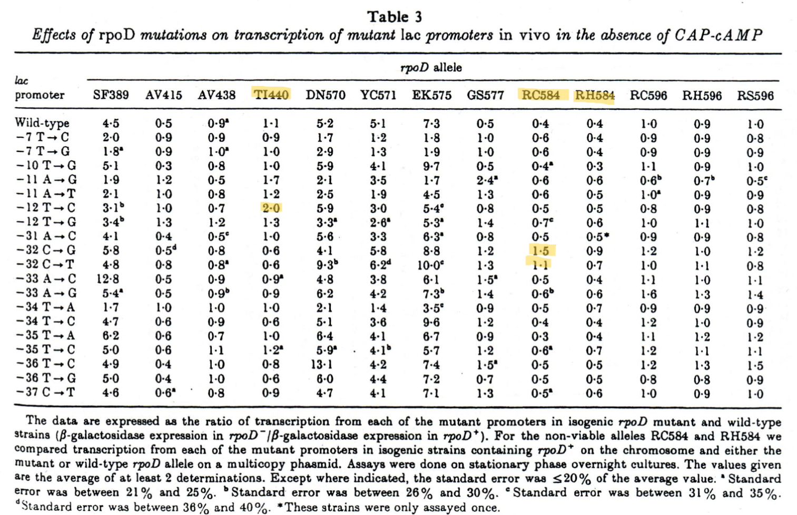
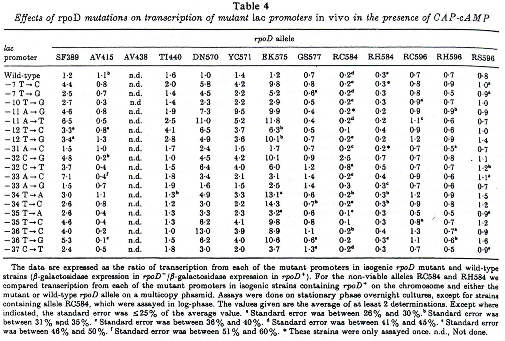
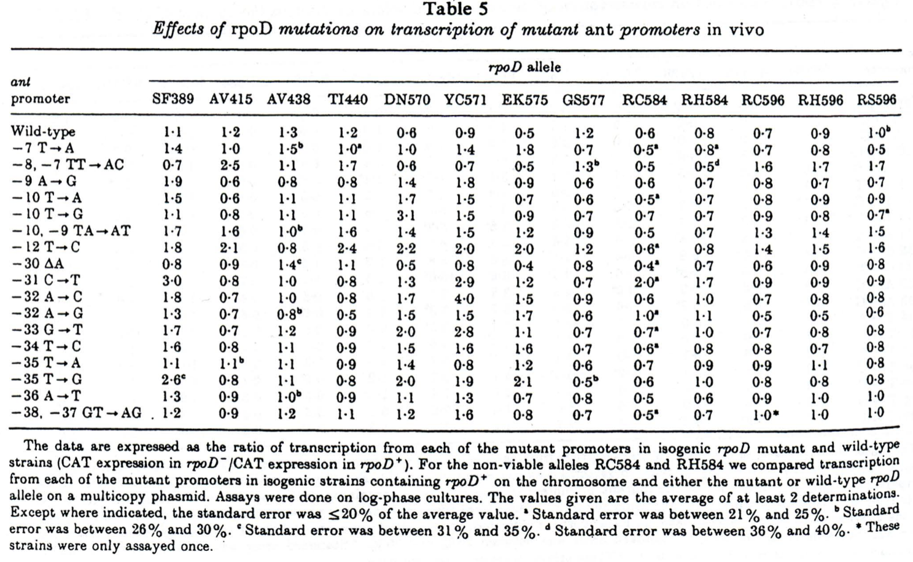

tags:: [[Base Sequence]], [[DNA]], [[Bacterial]], [[DNA-Directed RNA Polymerases]], [[Escherichia coli]], [[Genes]], [[Lac Operon]], [[Models]], [[Genetic]], [[Mutation]], [[Promoter Regions]], [[Sigma Factor]], [[Transcription Factors]], [[Transcription]]
date:: [[Apr 20th, 1989]]
issn:: 0022-2836
issue:: 4
extra:: PMID: 2661828
doi:: 10.1016/0022-2836(89)90568-8
title:: Altered promoter recognition by mutant forms of the sigma 70 subunit of Escherichia coli RNA polymerase
pages:: 591-603
volume:: 206
item-type:: [[journalArticle]]
original-title:: Altered promoter recognition by mutant forms of the sigma 70 subunit of Escherichia coli RNA polymerase
language:: eng
publication-title:: Journal of Molecular Biology
journal-abbreviation:: J Mol Biol
authors:: [[D. A. Siegele]], [[J. C. Hu]], [[W. A. Walter]], [[C. A. Gross]]
library-catalog:: PubMed
links:: [Local library](zotero://select/library/items/9G95AD5Q), [Web library](https://www.zotero.org/users/6106196/items/9G95AD5Q)

- [[Abstract]]
	- We have systematically assayed the in vivo promoter recognition properties of 13 mutations in rpoD, the gene that encodes the sigma 70 subunit of Escherichia coli RNA polymerase holoenzyme, using transcriptional fusions to 37 mutant and wild-type promoters. We found three classes of rpoD mutations: (1) mutations that suggest contacts between amino acid side-chains of sigma 70 and specific bases in the promoter; (2) mutations that appear to affect either sequence independent contacts to promoter DNA or isomerization of the polymerase; and (3) mutations that have little or no effect on promoter recognition. Our results lead us to suggest that a sequence near the C terminus of sigma 70, which is similar to the helix-turn-helix DNA binding motif of phage and bacterial DNA binding proteins, is responsible for recognition of the -35 region, and that a sequence internal to sigma 70, in a region which is highly conserved among sigma factors, recognizes the -10 region of the promoter. rpoD mutations that lie in the recognition helix of the proposed helix-turn-helix motif affect interactions with specific bases in the -35 region, while mutations in the upstream helix, which is thought to contact the phosphate backbone, have sequence-independent effect on promoter recognition.
- Attachments
	- [PubMed entry](http://www.ncbi.nlm.nih.gov/pubmed/2661828)
	- [PDF](zotero://select/library/items/QT4PZVA5) {{zotero-imported-file QT4PZVA5, "Siegele et al. - 1989 - Altered promoter recognition by mutant forms of the sigma 70 subunit of Escherichia coli RNA polymer.pdf"}}
- Sigma factors are small subunits of RNA polymerase that preferentially bind to certain promoter sequences, increasing the transcription of those genes
	- from sam
- \sigma subunit of RNA pol is what confers specificity to promoter regions
	- \sigma70 is the main one that's most commonly used
	- Bacteria can turn on other \sigma factors in response to stresses to change gene expression
- They use transcriptional fusions to mutant and wild type promoters with mutants of RNA pol \sigma70 to see what the mutations are doing
- \sigma70 doesn't bind DNA
	- Maybe it can recognize the conserved sequences and the distance between them as a stabilizing factor?
	- Sit on top of DNA and not bind with any strength until it has that -10 and -35 site?
- ((68d9bf98-2599-4042-a312-89733e99a8e0))
	- Several steps in RNA synthesis
		- binding of RNA polymerase to promoter DNA to form a closed complex
		- at least two isomerizations of the protein-DNA complex to form an open complex
			- DNA at transcription start site is melted
		- Formation of initial RNA bonds
		- clearance of the promoter + elongation of RNA
			- get going on transcribing
	- There's 5 subunits in bacterial RNA pol
		- \alpha_2, \beta, \beta', \sigma
			- \sigma is required for specific site recognition
	- There's two conserved hexamers for \sigma70
		- -10 hexamer TATAAT
		- -35 hexamer TTGACA
		- separated by 17 +- 1 bp
	- \sigma32 does heat shock expression and has a different set of promoter sequences
		- a bit longer
	- They use mutations in rpoD (gene coding for \sigma70) that alter selectivity of transcription initiation
		- Increased expression from weak promoters
		- don't need CAP-cAMP for ara, mal, or lac operons
	- Propose that there's a C terminus region that recognizes -35 and a central core that recognizes -10
- ((68d9bf8c-beea-4dfc-a58a-e514e1b2cbe8))
	- heat inducible \lambda (cI857)
	- mutant with severe down mutation in the lac promoter
	- strain that's immune to \lambda? \lambda imm 21
	- Table 1 describes a whole bunch of genotypes that I will maybe reference
	- Construction of strains containing the lac promoter fusions
		- Transfer of mutations in lac promoter from one strain to another by recombination
			- I think they use a generalized transducing phage for this? P1?
				- seems like it's lambda doing all the transducing
		- Select for transductants / recombinants by plating on CAG679 which is \Delta\lac
			- so successful ones would be blue
		- They check that the strains have the same mutations by sequencing
		- They describe how they make each of the strains that carry both promoter mutation in lac and the rpoD mutation
			- it's the phage derivative being used to transduce into the bacteria that has the rpoD mutation
			- look for lysogens
		- for some they do a co-transduction with a Tn10 that's linked to rpoD
			- these ones are detected by mal+ phenotype
			- or some of them are mal-, but either way you have an indicator agar for that
		- they have two alleles that are lethal so these need to be packaged with an rpoD+
			- they go on phasmids (phagemids) to get lysogenized into the genome
	- Construction of strains containing ant promoter fusions
		- phage P22 Kan vectors
			- CAT (antibiotic resistance) goes under the control of the P22 ant promoter
		- get these by conjugation with salmonella strains with the mutations in the ant promoter
		- use Tn10 to get it into the genome
		- selected with kanamycin and tetracycline
		- same thing with the non-viable mutations, phagemid lysogens
	- Enzyme assays
		- assay \beta-galactosidase production under the mutant lac promoter
		- some details about how they grow the cultures to get the bacteria to be in the right growth stage
			- I don't think this really matters
		- ant promoter activity was measured by assaying chloramphenicol transacetylase activity
- ((68d9c413-13c7-445f-aac4-fc050f009aaa))
	- ((68d9d4d6-3f07-478f-973e-2a5e264286b0))
		- This seems like the key part of their thinking
		- Question is if rpoD interacts with specific bases in the promoter region
		- If it does, then mutant rpoD should interact differently with mutant promoter
	- they use single base pair mutations in the lac and ant promoters
		- these are carried on \lambda\imm21plac5
			- measure by Xgal assay
		- or P22 for ant promoter
			- measure by chloramphenicol activity assay
	- Table 2 lists the rpoD mutants and their selection procedure
	- lac promoter mutations are tested both in presence and absence of cAMP
		- CAP-cAMP is a transcriptional activator
			- so test if that's what's causing the difference
- Tables
	- for all tables the a b c d footnotes are std error groupings, can ignore
	- All are ratios of mutant to wt (\beta\gal in rpoD- / \beta\gal in rpoD+)
	- {:height 490, :width 741}
		- lac w/o cAMP
	- 
		- lac w/ cAMP
	- 
		- ant
	- I kind of understand how they get this but some of it is a little lost to me
- Descriptions of the mutants
	- Mutations with little or no effect on promoter recognition
		- AV438, RC596, RH596, RS596
			- RH596 tom specifically calls out
		- The mutants are notated as amino acid substitutions
			- holy shit that makes such a big difference
		- funny that they have no statistics on anything
		- There's some small changes but nothing really measurable
		- so basically they're doing structural queries
			- R
	- Mutations with moderate to large effects on recognition, broad positions
		- SF389, AV415, DN570, YC571, EK575, GS577
		-
	- Mutations that suggest contacts with specific positions in the promoter
		- RC584, RH584, TI440
			- these ones I see
			- TI is -12 specifically
			- 584s are at the -32