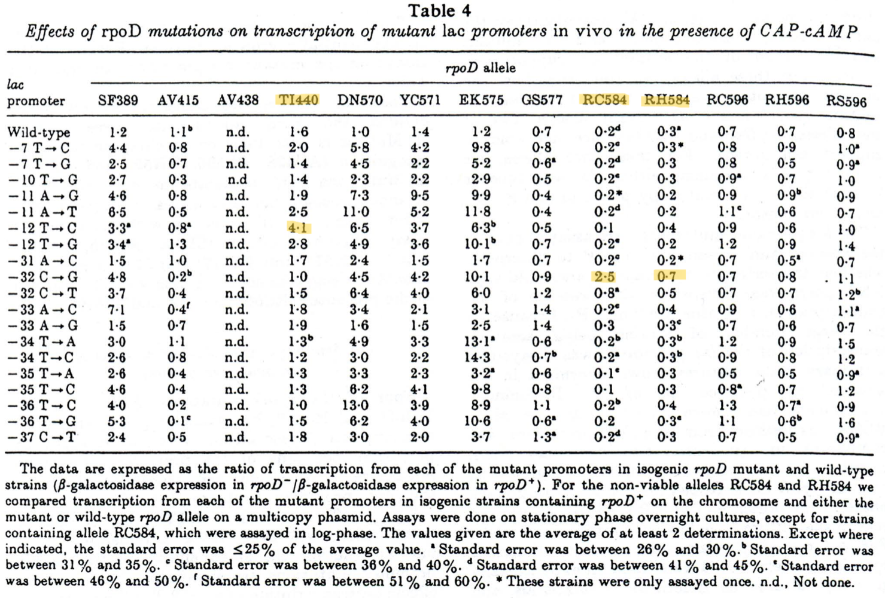

tags:: [[Base Sequence]], [[DNA]], [[Bacterial]], [[DNA-Directed RNA Polymerases]], [[Escherichia coli]], [[Genes]], [[Lac Operon]], [[Models]], [[Genetic]], [[Mutation]], [[Promoter Regions]], [[Sigma Factor]], [[Transcription Factors]], [[Transcription]]
date:: [[Apr 20th, 1989]]
issn:: 0022-2836
issue:: 4
extra:: PMID: 2661828
doi:: 10.1016/0022-2836(89)90568-8
title:: Altered promoter recognition by mutant forms of the sigma 70 subunit of Escherichia coli RNA polymerase
pages:: 591-603
volume:: 206
item-type:: [[journalArticle]]
original-title:: Altered promoter recognition by mutant forms of the sigma 70 subunit of Escherichia coli RNA polymerase
language:: eng
publication-title:: Journal of Molecular Biology
journal-abbreviation:: J Mol Biol
authors:: [[D. A. Siegele]], [[J. C. Hu]], [[W. A. Walter]], [[C. A. Gross]]
library-catalog:: PubMed
links:: [Local library](zotero://select/library/items/9G95AD5Q), [Web library](https://www.zotero.org/users/6106196/items/9G95AD5Q)

- [[Abstract]]
	- We have systematically assayed the in vivo promoter recognition properties of 13 mutations in rpoD, the gene that encodes the sigma 70 subunit of Escherichia coli RNA polymerase holoenzyme, using transcriptional fusions to 37 mutant and wild-type promoters. We found three classes of rpoD mutations: (1) mutations that suggest contacts between amino acid side-chains of sigma 70 and specific bases in the promoter; (2) mutations that appear to affect either sequence independent contacts to promoter DNA or isomerization of the polymerase; and (3) mutations that have little or no effect on promoter recognition. Our results lead us to suggest that a sequence near the C terminus of sigma 70, which is similar to the helix-turn-helix DNA binding motif of phage and bacterial DNA binding proteins, is responsible for recognition of the -35 region, and that a sequence internal to sigma 70, in a region which is highly conserved among sigma factors, recognizes the -10 region of the promoter. rpoD mutations that lie in the recognition helix of the proposed helix-turn-helix motif affect interactions with specific bases in the -35 region, while mutations in the upstream helix, which is thought to contact the phosphate backbone, have sequence-independent effect on promoter recognition.
- Attachments
	- [PubMed entry](http://www.ncbi.nlm.nih.gov/pubmed/2661828)
	- [PDF](zotero://select/library/items/QT4PZVA5) {{zotero-imported-file QT4PZVA5, "Siegele et al. - 1989 - Altered promoter recognition by mutant forms of the sigma 70 subunit of Escherichia coli RNA polymer.pdf"}}
- Sigma factors are small subunits of RNA polymerase that preferentially bind to certain promoter sequences, increasing the transcription of those genes
	- from sam
- \sigma subunit of RNA pol is what confers specificity to promoter regions
	- \sigma70 is the main one that's most commonly used
	- Bacteria can turn on other \sigma factors in response to stresses to change gene expression
- They use transcriptional fusions to mutant and wild type promoters with mutants of RNA pol \sigma70 to see what the mutations are doing
- \sigma70 doesn't bind DNA
	- Maybe it can recognize the conserved sequences and the distance between them as a stabilizing factor?
	- Sit on top of DNA and not bind with any strength until it has that -10 and -35 site?
- ((68d9bf98-2599-4042-a312-89733e99a8e0))
  collapsed:: true
	- Several steps in RNA synthesis
		- binding of RNA polymerase to promoter DNA to form a closed complex
		- at least two isomerizations of the protein-DNA complex to form an open complex
			- DNA at transcription start site is melted
		- Formation of initial RNA bonds
		- clearance of the promoter + elongation of RNA
			- get going on transcribing
	- There's 5 subunits in bacterial RNA pol
		- \alpha_2, \beta, \beta', \sigma
			- \sigma is required for specific site recognition
	- There's two conserved hexamers for \sigma70
		- -10 hexamer TATAAT
		- -35 hexamer TTGACA
		- separated by 17 +- 1 bp
	- \sigma32 does heat shock expression and has a different set of promoter sequences
		- a bit longer
	- They use mutations in rpoD (gene coding for \sigma70) that alter selectivity of transcription initiation
		- Increased expression from weak promoters
		- don't need CAP-cAMP for ara, mal, or lac operons
	- Propose that there's a C terminus region that recognizes -35 and a central core that recognizes -10
- ((68d9bf8c-beea-4dfc-a58a-e514e1b2cbe8))
  collapsed:: true
	- heat inducible \lambda (cI857)
	- mutant with severe down mutation in the lac promoter
	- strain that's immune to \lambda? \lambda imm 21
	- Table 1 describes a whole bunch of genotypes that I will maybe reference
	- Construction of strains containing the lac promoter fusions
		- Transfer of mutations in lac promoter from one strain to another by recombination
			- I think they use a generalized transducing phage for this? P1?
				- seems like it's lambda doing all the transducing
		- Select for transductants / recombinants by plating on CAG679 which is \Delta\lac
			- so successful ones would be blue
		- They check that the strains have the same mutations by sequencing
		- They describe how they make each of the strains that carry both promoter mutation in lac and the rpoD mutation
			- it's the phage derivative being used to transduce into the bacteria that has the rpoD mutation
			- look for lysogens
		- for some they do a co-transduction with a Tn10 that's linked to rpoD
			- these ones are detected by mal+ phenotype
			- or some of them are mal-, but either way you have an indicator agar for that
		- they have two alleles that are lethal so these need to be packaged with an rpoD+
			- they go on phasmids (phagemids) to get lysogenized into the genome
	- Construction of strains containing ant promoter fusions
		- phage P22 Kan vectors
			- CAT (antibiotic resistance) goes under the control of the P22 ant promoter
		- get these by conjugation with salmonella strains with the mutations in the ant promoter
		- use Tn10 to get it into the genome
		- selected with kanamycin and tetracycline
		- same thing with the non-viable mutations, phagemid lysogens
	- Enzyme assays
		- assay \beta-galactosidase production under the mutant lac promoter
		- some details about how they grow the cultures to get the bacteria to be in the right growth stage
			- I don't think this really matters
		- ant promoter activity was measured by assaying chloramphenicol transacetylase activity
- ((68d9c413-13c7-445f-aac4-fc050f009aaa))
  collapsed:: true
	- ((68d9d4d6-3f07-478f-973e-2a5e264286b0))
		- This seems like the key part of their thinking
		- Question is if rpoD interacts with specific bases in the promoter region
		- If it does, then mutant rpoD should interact differently with mutant promoter
	- they use single base pair mutations in the lac and ant promoters
		- these are carried on \lambda\imm21plac5
			- measure by Xgal assay
		- or P22 for ant promoter
			- measure by chloramphenicol activity assay
	- Table 2 lists the rpoD mutants and their selection procedure
	- lac promoter mutations are tested both in presence and absence of cAMP
		- CAP-cAMP is a transcriptional activator
			- so test if that's what's causing the difference
- Tables
	- for all tables the a b c d footnotes are std error groupings, can ignore
	- All are ratios of mutant to wt (\beta\gal in rpoD- / \beta\gal in rpoD+)
	- {:height 490, :width 741}
		- lac w/o cAMP
	- 
		- lac w/ cAMP
	- 
		- ant
	- I kind of understand how they get this but some of it is a little lost to me
- Descriptions of the mutants
	- Mutations with little or no effect on promoter recognition
		- AV438, RC596, RH596, RS596
			- RH596 tom specifically calls out
		- The mutants are notated as amino acid substitutions
			- holy shit that makes such a big difference
		- funny that they have no statistics on anything
		- There's some small changes but nothing really measurable
		- so basically they're doing structural queries
			- R596 isn't very important for binding
	- Mutations with moderate to large effects on recognition, broad positions
		- SF389, AV415, DN570, YC571, EK575, GS577
		- 389, 570, 571, and 575 have relatively big effects and increase activity
		- 415 and 577 are weaker
- Mutations that suggest contacts with specific positions in the promoter
	- RC584, RH584, TI440
		- these ones I see
		- TI is -12 specifically
		- 584s are at the -32
	- R584C lowers expression by a lot for everything except one location (-32)
		- It's much better at recognizing T or G here than the native C
		- not dependent on cAMP
		- on the ant promoter it's at location -31
			- this shows it's not lac specific
		- It's also something about this location, because R584H has the same phenotype (but weaker)
		- This could be a pretty strong mutant because they mention that it gets a lot of suppressors
			- so the signal could be weaker because of that
		- may actually change the consensus sequence
			- hard to tell because this is a lethal mutant
			- about 20% of the \sigma70 in the cell is wt in order for it to not die
	- TI440 mutation
		- this seems to alter discrimination between consensus and non consensus at the first position of -10 hexamer (-12 position on both lac and ant promoter)
		- T->C change at -12 makes this mutant a lot better
	- Figures 2 and 3 are not super helpful but it's a more in depth look at the base specificity of these mutants
- ((68d9e1a5-d802-4026-8ded-f3894e835c60))
	- The rpoD mutants that have non specific effects probably change protein-protein interactions  or maybe sequence independent interactions with DNA
	- 596 is involved with the activator araC
		- there's a big change in the activity of that operon with this mutant, but that doesn't generalize to any other system, or uninduced ara
		- potentially an exposed site on the enzyme that can contact an activator
	- Conserved regions of \sigma factors have helix turn helix DNA binding motifs
		- these are the regions that interact with the -10 and -35 hexamers
- Proposed contacts
	- -35
		- Arg584 is likely at the N terminus of the HTH motif
			- these are the -32 position mutations
		- Companion paper shows that Arg588 interacts with a different base in the -35 hexamer
		- different \sigma factors can vary this region to get slightly different binding profiles
	- -10
		- TI440 isn't in any known DNA binding motif (at the time)
		- speculation that this is important for locating the TSS
			- based on crosslinking experiments
		- could be a binding to RNA pol core
		- bind to single stranded DNA as it's melted?
- Tom questions about this paper
	- purified \sigma70, the "housekeeping" \sigma factor in *E. coli*, does not bind DNA. Does this surprise you? Can you think of a reasonable explanation for this fact? How does \sigma70 recognize promoters?
		- It is a bit surprising
		- My intuition is that \sigma70 can have a very weak binding to DNA, and maybe it's more like a conformational change that being near DNA exerts on it as a subunit of RNA pol
			- as in, \sigma70 is attached strongly to the RNA pol complex and being in the correct region of DNA (promoter) makes it pull on the complex in such a way that it starts transcription
		- Also it could be measuring the distance between the hexamers? not sure how this would work
	- Where did all the promoter and rpoD mutations come from? What criteria do they use to establish selectivity?
		- rpoD mutations are found by looking for slightly increased expression of weak promoters in lac, ara, and mal
			- at least some of these are because of a binding to araC or malT as they say in the discussion
		- promoter mutations I am less sure on
			- they're from another paper
	- Could you identify the interesting mutations from the raw data in Table 3, 4, and 5, or did you need the author's help?
		- to some extent I could find them myself, especially the single base ones
		- The mild effect ones are tough to identify
	- The authors divide the *rpoD* mutations into three classes. Think carefully about the explanations provided for these diverse effects on the various mutant promoters. Do you agree? Can you think of alternative explanations? Pay particular attention to R596H. You will see that mutation again.
	- In the Discussion, Siegele et al. note the conserved regions in \sigma factors shown below. What do you think is the function of the inhibitory domain?
	-