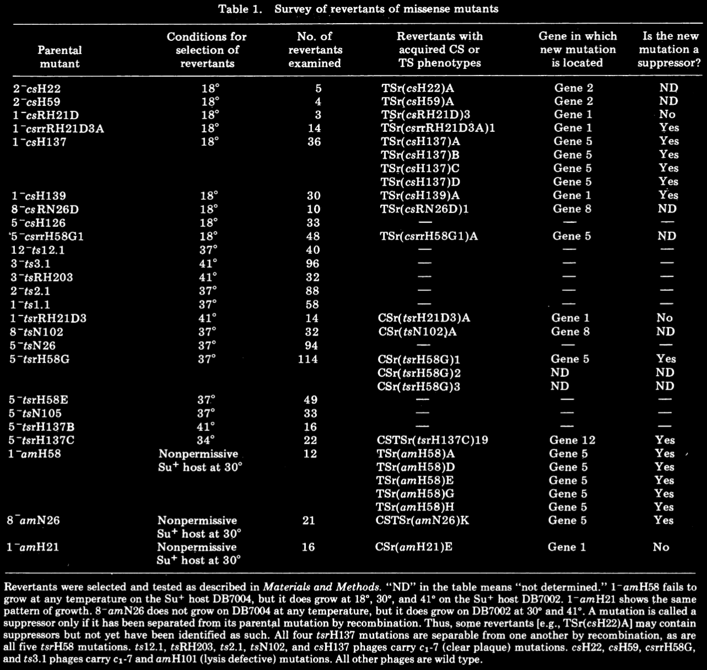
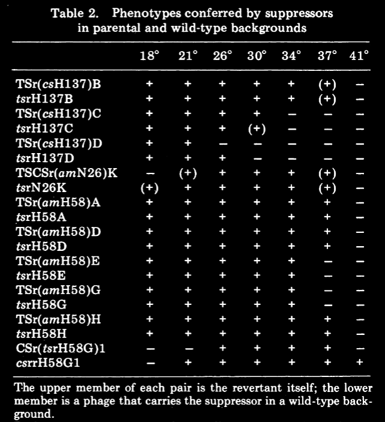

date:: 07/1975
issn:: "0027-8424, 1091-6490"
issue:: 7
doi:: 10.1073/pnas.72.7.2738
title:: Conditional-lethal mutations that suppress genetic defects in morphogenesis by altering structural proteins.
pages:: 2738-2742
volume:: 72
item-type:: [[journalArticle]]
access-date:: 2025-09-04T20:52:13Z
original-title:: Conditional-lethal mutations that suppress genetic defects in morphogenesis by altering structural proteins.
language:: en
url:: https://pnas.org/doi/full/10.1073/pnas.72.7.2738
publication-title:: Proceedings of the National Academy of Sciences
journal-abbreviation:: Proc. Natl. Acad. Sci. U.S.A.
authors:: [[J Jarvik]], [[D Botstein]]
library-catalog:: DOI.org (Crossref)
links:: [Local library](zotero://select/library/items/MHM28KU5), [Web library](https://www.zotero.org/users/6106196/items/MHM28KU5)

- [[Abstract]]
	- An analysis of revertants of missense mutants in phage P22 has shown: (i) New temperature-sensitive (TS) and cold-sensitive (CS) phenotypes are often acquired concomitant with reversion. (ii) In many cases, these new phenotypes are due to second-site mutations (suppressors) that correct the original defect. (iii) Sometimes the suppressor mutation is not in the same gene as the original mutation. (iv) Extragenic suppressors are almost always in genes whose products are known to interact physically with the original gene products. (v) The suppressor mutations typically retain their TS or CS phenotypes when crossed into wild-type genetic backgrounds. (vi) Some TS and CS mutants derived by reversion can themselves be reverted to produce additional mutations.
- Attachments
	- [PDF](zotero://select/library/items/C89NZV78) {{zotero-imported-file C89NZV78, "Jarvik and Botstein - 1975 - Conditional-lethal mutations that suppress genetic defects in morphogenesis by altering structural p.pdf"}}
- Temperature sensitive mutations are acquired at the same time as reversion
	- due to suppressors
- Conditional lethal mutants have an absolute selection in the nonpermissive condition
	- This is pretty great for looking for revertants
- Suppressors are useful but it's hard to find them because they don't have their own phenotype
	- Unless? uwu
	- Suppressors are often missense mutations
	- Missense mutation often confer cold or hot sensitive properties
- Methods
	- I'm not 100% clear on what su+ or am- really means
		- oh am is probably amber (yep)
	- some complicated nomenclature going on here
- Results
	- Spontaneous mutants
	- 
		- what a table
		- This is the whole paper lmao
		- Main conclusion is that there is a high probability that a missense mutant can yield a new hot or cold sensitive mutant
			- Not all of them did but a pretty strong majority
		- 9 cold sensitive got 8 temp sensitive mutants
		- 13 hot got 4 cold mutants
		- 3 amber all 3 got one or the other
	- Suppressors were identified by the genic location of the reverting mutation
		- If it's on a different gene, then it's a suppressor
			- This is true because it's definitely not a back mutation or a frameshift if it's in a different gene
		- Suppressors separated by recombination and they themselves confer the temp sensitivity
			- 
			- Main takeaway from this is that they're basically the same
			- The suppressor gene has the temperature sensitivity
- Discussion
	- CS mutants more readily revert to temperature sensitivity than the other way around
		- 1/20 for CS vs 1/100 for TS
	- Suppressor mutations are in almost all cases in proteins that interact with the parental protein
		- There is likely some 3D interaction stuff going on
		- Many of the suppressors are in gene 5, a capsid protein
		- gene 1 is a structural protein associated with the capsid, gene 8 also interacts
	- These reversions with temperature sensitivity are really useful
		- Temporal sequencing from some other paper
			- How does this work? maybe look at reference 4
		- Reversion is not mutagenesis
			- no double mutants
			- selective by nature
		- Function specific
			- Has to target a very specific thing
			- This remains true in more complex organisms
			- Could be useful in studying covalent protein interactions