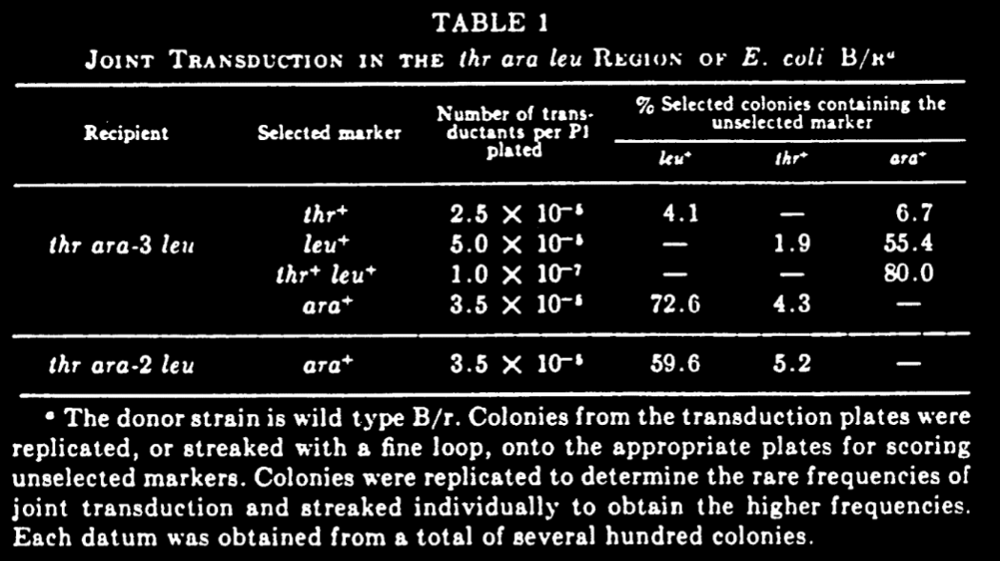

date:: 11/1959
issn:: 00426822
issue:: 3
doi:: 10.1016/0042-6822(59)90125-4
title:: Determination of the order of mutational sites governing l-arabinose utilization in Escherichia coli by transduction with phage P1bt
pages:: 314-331
volume:: 9
item-type:: [[journalArticle]]
access-date:: 2025-09-04T21:24:17Z
rights:: https://www.elsevier.com/tdm/userlicense/1.0/
original-title:: Determination of the order of mutational sites governing l-arabinose utilization in Escherichia coli by transduction with phage P1bt
language:: en
url:: https://linkinghub.elsevier.com/retrieve/pii/0042682259901254
publication-title:: Virology
journal-abbreviation:: Virology
authors:: [[J. Gross]], [[E. Englesberg]]
library-catalog:: DOI.org (Crossref)
links:: [Local library](zotero://select/library/items/H62XICFA), [Web library](https://www.zotero.org/users/6106196/items/H62XICFA)

- Notes below
- Abstract
	- arabinose mutants
	- 3 and 4 factor transduction experiments with phage P1bt
	- thr and leu located on either side of the arabinose cluster
	- abortive transduction tests
	- assayed with complementation
	- I didn't really understand that but lets get into it
- Introduction
	- auxotrophic salmonella mutants for tryptophan and histidine can be divided into groups based on blocks in biosynthesis
		- Does he mean literal block like they can't do this or block like genomic chunks
	- Mutants in different groups were linked in transduction experiments
		- I don't know what that means either
	- Grouping of mutant sites on the chromosome corresponds closely to grouping by functional criteria
		- Sooo like operons? lac z y a all close together
	- "Order of groups on the chromosome was the same as that of the sequence of biochemical reactions which they controlled"
		- so yes like operons
	- Most mutant site orders haven't been determined
	- You can jointly transduce genes that are close to each other
		- In this case thr leu and ara markers can be done together (ara in the middle)
	- So they go about using that joint transduction strategy to locate 17 arabinose mutants
- Materials and Methods
	- Will skim this
	- Media has either arabinose or glucose as sugar, and w/ & w/o threonine and leucine
	- *Escherichia coli* B/r, threonine requiring mutant, leucine requiring mutant (auxotroph)
	- *thr leu* strain was the basis for all arabinose mutants
		- *thr* mutant irradiated and *ara* mutant isolated
		- Phage was grown on the *leu* mutant and transduced the *thr ara* strain
		- selected for *ara*+ transductants
		- One clone that was auxotrophic for leu, thr, and ara was the parent
	- These are mutants that can't use arabinose
	- They also make a complementary strain that is *thr+ ara leu+*
- Results
	- Position of ara Mutants in Relation to thr and leu
		- ara-2 and ara-3 are on opposite ends of the arabinose region
		- But generally arabinose is close to leu and far from thr
			- estimated by frequencies of joint transduction
		- Order is *thr ara leu* and not *thr leu ara* is
			- 6% of thr+ transductants are ara+, 4% are leu+
			- 80% of thr+ leu+ transductants are ara+, 55.4% leu+ are ara+
			- 
			- ara-2 is further away, lower percent cotransduction with leu+
	- Recombination between ara mutants
		- nonidentical ara mutants are crossed. Recipient is auxotrophic for both, donor is + for both thr and leu
			- select for thr leu ara triple + (on separate plates)
			- thr+ and leu+ are similar numbers to wt donor, but ara+ is lower
		- Estimate the distance between two ara sites by ratio of ara+ to leu+ transductants in the same experiment
			- Looking for complementation?
			- Ratio is ~70% with any ara mutant and wt donor and varies for the various ara mutants
	- Order of ara sites
		- Reciprocal crosses with pairs of ara mutants
		- In each case the recipient is auxotrophic for thr and leu and the donor is thr+ leu+
		-
-