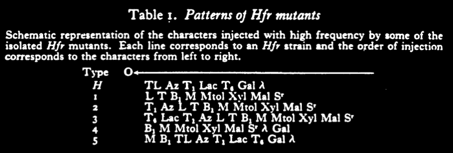

tags:: [[CHROMOSOMES]], [[Chromosomes]], [[ESCHERICHIA COLI]], [[Escherichia coli]], [[Physical Examination]]
date:: 1958
issn:: 0081-1386
extra:: PMID: 13580863
title:: Genetic and physical determinations of chromosomal segments in Escherichia coli
pages:: 75-92
volume:: 12
item-type:: [[journalArticle]]
original-title:: Genetic and physical determinations of chromosomal segments in Escherichia coli
language:: eng
publication-title:: Symposia of the Society for Experimental Biology
journal-abbreviation:: Symp Soc Exp Biol
authors:: [[F. Jacob]], [[E. L. Wollman]]
library-catalog:: PubMed
links:: [Local library](zotero://select/library/items/K88TJKRM), [Web library](https://www.zotero.org/users/6106196/items/K88TJKRM)

- Notes below
- Conjugation - oriented transfer of DNA from donor to recipient bacteria
	- Oriented in the sense that there is an order of the transferring, and a rate
- The Genetic system of E. Coli K-12
	- Process of conjugation
		- Genetic recombination may be seen between different strains of E. Coli
		- You can plate on selective media (agars) to select of recombinants
		- Recipient bacteria referred to by F-
		  background-color:: green
			- they're all the same
		- Two main types of donors
			- Most are F+
				- When mixed with F- cells they have a low frequency (10^-5)
			- Some strains have a high frequency of recombination and are called *Hfr*
				- but this is actually only for certain parts of their genome
				- Up to 1/10
			- this high freq allows you to analyze conjugation at the cell level
		- Steps of conjugation
			- id:: 68ba0a7f-f49a-462d-91d6-39bf2dfa6c9b
			  1. Establishment of an effective contact between cells of opposite mating types
				- This is pretty fast, all possible matings occus within 30 min
				- There's a bridge between the bacteria (sex pilus?)
			- 2. Oriented transfer of chromosomal segment of the *Hfr* donor
				- Analysis by interrupting by mechanical disruption (blending)
				- Genetic character linearly arranged on the *Hfr* chromosome penetrate in a specific order and always in the same way, starting from O (origin)
				- Interruption of mating doesn't stop anything that already made it from being integrated
				- Spontaneous breaks happen, so you normally don't get the whole chromosome transferred
			- 3. Recombination, *Hfr* fragment integrates
			- 4. Expression, now that F- has it, it makes protein
		- Things further on the chromosome are slower to integrate and less likely
	- The mating system of *E. coli* K-12
		- Comparing *Hfr* and F+ - what's the difference?
			- Effective contacts are the same
			- Low frequency of transfer is the issue
		- Hypothesis is that F+ doesn't actually exist and there's just a low proportion of *Hfr* in that population
			- Ah I am thinking about this wrong
			- F+ is a plasmid, not a cell (although similar in concept)
			- What this is actually saying is that some genes are capable of being transferred, while others are not
			- So called F+ genes can have additional mutations that make them into Hfr, and those are the ones that get transferred
	- Pattern of chromosome transfer in *Hfr* mutants
		- Hfr mutants have to be different because they can only transfer some genes and not others
		- No Hfr mutant has been found that can transfer all known markers
			- Any gene can be transferred by some mutant, but they are distinct
		- You can learn from any given mutant the order that they transfer things by interrupting transfer by blending
		- chromosome starts transferring from O, and that origin determines which genes get transferred and when (but always in the same order)
		- 
			- This is the crux
				- See that the order is always preserved, regardless of the actual one that comes first
				- It can be backwards or forwards, but it is the same order (and it loops! wonder what else loops....)
		- Bacteria must have a circular chromosome!
		- Origin O chooses a place on the circle and that becomes the start
		- Frequency of transmission decreases as you move along the circle
			- Transfer polarity - some break is likely to happen during the transfer
		- Very few recombinants become F+ or Hfr after conjugation, they stay F-
			- Hfr gene is unlikely to transfer and is far from O
			- Hfr recombinants pass on in the same order as their parent
	-
-