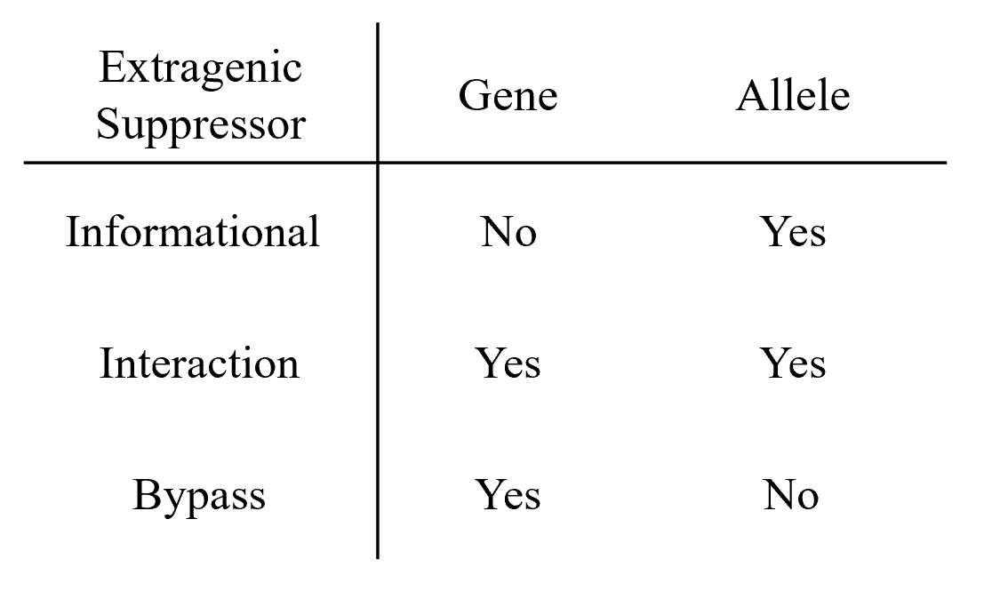
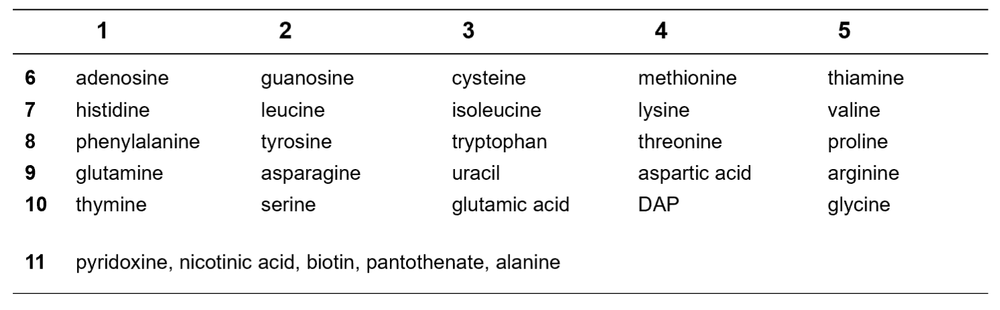

- Molecular Biology the one and only
- [[MOL514/Midterm]]
- [[Oct 29th, 2025]] Minimal Cell
  collapsed:: true
	- Last class with Tom :')
	- Reading
		- [[Genetic requirements for cell division in a genomically minimal cell]]
	- Synthetic bacteria
		- building off of horowitz and leupold essential gene screen that showed there shouldn't be that many
	- Craig Venter published the first complete sequence of an organism (influenza)
		- shotgun sequencing
		- Celera genomics, Institute for genomic research
		- Also J Craig Venter Institute "JCVI" from the paper
	- Michael Smith won Nobel with Carrie mullis(?) for PCR
		- postdoc I forgot name did site directed mutagenesis
	- Khorana did total synthesis of amber suppressor tRNA
		- Nobel for this, shared with Nirenberg
	- Synthesizing a virus (polio) got a lot of hate, bacteria no one really cared
	- FtsZ forms a contractile ring where the septum forms
	- Midterm
	  background-color:: yellow
		- open everything except talking, also no AI
		- some questions are library, some are hypothetical
		- Try to do a few question a day
		- Answer should fit in less than a page
		- can use drawings when appropriate
		- Separate page for each question with name on each
		- due LTL305 by noon next wednesday
		- also cite references if it's particularly relevant
- [[Oct 27th, 2025]] Outer Membrane Biogenesis
  collapsed:: true
	- Reading
		- [[Identification and characterization of a new gene of Escherichia coli K-12 involved in outer membrane permeability.]]
		- [[Chemical Conditionality: A Genetic Resource Strategy to Probe Organelle Assembly]]
	- OM has \beta barrels instead of \alpha helices
	- loss of functions are recessive
		- there's something that needs to happen that isn't, and a second allele will take over
	- gain of function is dominant
		- this can't be a null because it's gotta be making something
	- transposon cuts can be internal or external
		- take what's in the middle or take everything else
- [[Oct 24th, 2025]] Translation Initiation
  collapsed:: true
	- Reading
		- [[Mutations that affect lamB gene expression at a posttranscriptional level.]]
		- [[A role for mRNA secondary structure in the control of translation initiation]]
	- Fun class where we kinda went over the parts of DNA sequence that we've learned
	- lamB-lacZ fusion is both transcriptional and translational
		- lacZ is a translational fusion
		- lacY is a transcriptional fusion
	- Translational coupling can happen, but usually downstream gene is translated independently
	- most sRNA interfere with Shine-Dalgarno sequence
		- trans regulatory system
	- hairpins in the mRNA are acting in cis
- [[Oct 22nd, 2025]] Protein Targeting
  collapsed:: true
	- Reading
		- [[Mutations altering the cellular localization of the phage X receptor, an Escherichia coli outer membrane protein]]
		- [[Sequence analysis of mutations that prevent export of lambda receptor, an Escherichia coli outer membrane protein]]
			- This one we won't talk about, it's just to show how shitty DNA sequencing was at the time
		- [[TnphoA: a transposon probe for protein export signals.]]
	- maltose polymers (dextrins) go through lamB, caught by MalE in periplasm, and then transported across inner membrane by ABC transporter (MalGFK)
	- MalP and Q are in the cytoplasm
	- lamB is forward and reverse selection
		- gain with maltose transport
		- loss with growth on lambda
	- First paper all of the mutants were in the protein, but were not in localization
		- preventing localization means that the protein doesn't work
		- can't tell the difference between protein that doesn't work at all and one that doesn't localize correctly
	- alkaline phosphatase has to be in the periplasm because it needs disulfide bonds to form
		- cytoplasm is a reducing environment, periplasm is not
		- \beta\gal is the opposite -> it has to be in a reducing environment
			- turns into a big glob in the periplasm because of disulfide bonds
	- target size is very small
		- 800 selected, only 5 pass screen
		- signal sequence is only a few AA (~25)
	- hybrid protein is blocking it's own secretion so it builds up in the cytoplasm
	- cytoplasmic membrane proteins have a hydrophobic alpha helix
		- can easily tell where the membrane domain is, but not which face the other stuff is on
	- Tn5 is a composite transposon with IS50 elements, carries kanamycin R
	- pBR322 is the commonly used plasmid
		- has amp and tet resistance
		- select by using kanamycin to get high copy number
		- looking for jumps into \beta\-lactamase
	- hybrid protein joint is often cut by protease
	- tet resistance is a pump located in the inner membrane
		- so this should also have a signal sequence?
		- It doesn't have a specific signal sequence that's cleaved, but it does have a transmembrane domain that kinda functions like a signal sequence
		- phoA can be active depending on which face of the membrane it's on
	- suppressors of mutated signal sequence are Sec mutants
	- for membranes the first transmembrane acts as signal sequence
		- stops at second, restarts at third, etc
- [[Oct 20th, 2025]] Signal Transduction 2
  collapsed:: true
	- Reading
		- [[Initiation of sporulation in B. subtilis is controlled by a multicomponent phosphorelay]]
		- [[The Small RNA Chaperone Hfq and Multiple Small RNAs Control Quorum Sensing in Vibrio harveyi and Vibrio cholerae]]
	- 7 stages of sporulation
	- auto-phoshorylating histidine kinase
	- OmpR, CheY, Spo0A are response regulators
	- bypass suppressor upstream of Spo0A you would need a really extreme mutation
	- the dimer in paper 1 is not an artifact, it's common for these proteins to act as dimers
	- His->Asp->His->Asp
		- working principle of the phosphorelay
	- bacterial phosphates are very unstable
	- Paper 2
		- this ones got everything
			- epistasis, \sigma factors, suppressors, transposon mutagenesis, two component signaling, phosphorelay, rho independent transcription stop, etc
	- LuxN and LuxQ receptors have the autophosphorylating histidine and also the transfer Asp to go downstream
		- H1 and D1
	- LuxU is the receptor of the signal so that's H2
	- LuxO is response regulator so would be D2
	- kinase activity that uses ATP should be on during growth
		- turn it off when they're starving so you don't waste energy
	- \sigma54 is special because the transcriptional activators bind at a distance
		- this is more like eukaryotic systems
	- D47E is a phospho-mimetic
	- Hfq is downstream of LuxO
	- sRNA can block translation, trigger degradation, could activate
	- In this case it's doing message degradation
		- they had to do promoter fusion to test that
			- can't get message degradation in this context
- [[Oct 10th, 2025]] Signal Transduction 1
  collapsed:: true
	- Reading
		- [[Genetic analysis of the switch that controls porin gene expression in Escherichia coli K-12]]
		- [[EnvZ controls the concentration of phosphorylated OmpR to mediate osmoregulation of the porin genes]]
	- No Tom today
	- There's some ompC and ompF at all times
		- it's not an all the way on/off
	-
- [[Oct 8th, 2025]] Transcription regulation
  collapsed:: true
	- Reading
		- [[Activation of prokaryotic transcription through arbitrary protein-protein contacts]]
		- [[The functional subunit of a dimeric transcription activator protein depends on promoter architecture]]
	- 298 genes controlled by CAP
	- constitutive mutations in the repressor are recessive in diploid analysis
		- has been said before but I gotta repeat it
	- c_I is dominant
		- this one is a constitutively active repressor
	- second paper uses Lac EB5 mutation
		- mutation in the promoter that makes it close to the consensus sequence
		- this is in cis because it's a site that is not coding
	- CAP sites have dyad symmetry
	- Class 1 CAP sites are far away from TSS
		- -61.5, -72, -82, -92
	- Class 2 CAP sites are closer to the TSS, at -42, where it interferes with the polymerase binding site
	- CAP and RNA pol \alpha\CTD have contact
		- \alpha\CTD is wiggly so it doesn't show up on structures
		- moves around so it can reach over to the further away loci
	- Class 1 CAP sites overlap -35 region and can bind at the same time as \sigma
		- they're on two sides of DNA
	- mutants that can't activate are pc mutants (positive control)
		- need to avoid getting a null
			- with c1 you can do this by using phage for immunity
		- gal is an interesting system because it has two promoters
			- one for catabolism, one for anabolism
			- look for a lac-/gal-
				- this means that the same amino acid is required to activate both lac and gal
	- upstream binding sites affect K_B rate (polymerase attaching to promoter)
	- closer binding sites affect k_f rate
	- activator binding sites are generally always close to the promoter
		- there needs to be a direct interaction with activator and polymerase complex
	- E coli has 7 operons for ribosomal RNAs
		- upstream binding sites (UP)
		- these are super strong promoters and are like always on
	- P_RM \Delta50 is cut just after O_r2
	- interaction with \sigma is closer
		- araC
		- CAP in araC is further away and is probably interacting with \alpha
	-
- [[Oct 6th, 2025]] \lambda c1
  collapsed:: true
	- Reading
		- [[Mutant A phage repressor with a specific defect in its positive control function]]
		- [[Target of the Transcriptional Activation Function of Phage λ cl Protein]]
	- \lambda repressor prevents transcription from P_R by binding to the promoter site and blocking RNA pol binding
		- the same thing is happening at P_L
	- closed RNA pol complex is very stable
	- promoter can be weak because of a defect in either formation of the closed or open complex
	- Paper 1
		- activators work through cooperativity and proximity
		- localized mutagenesis on the plasmid and then insert the plasmid into a strain
			- nitrosoguanidine is a potent alkylating agent
		- Avoid frameshift and nonsense / null mutations in c1 by looking for immunity to super infection from phage
		- Table 1
			- line 2 shows that O_r3- doesn't impact the pc mutants
				- there's a slight increase in wild type because there's probably some binding to O_r3 when you have a high concentration of repressor
			- line 3 shows that O_r2 is necessary for repression
		- Maxam-Gilbert sequencing is apparently an enormous pain in the ass
			- so they do restriction enzyme cutting to try to get minimal fragment
		- \lambda repressor is probably stimulating open complex formation
	- Paper 2
		- where does the repressor contact polymerase?
			- looking for allele specific suppressor
		- E. coli carrying a salmonella prophage
			- "Susskind works with salmonella, so that's just how it will be"
		- PCR mutagenesis
			- error prone PCR
			- can buy kits for this now, these have very specific targeting with primers
		- rpoD has to be dominant because it's a different strain so wt rpoD (salmonella) can't activate the phage regions at all (because they're e coli)
		- R596 is a site that interacts with activators
			- that's what going on with CAP in ara operon, and with c1 in \lambda
			- this is conserved
		- c1 is at position -41 relative to the promoter
			- contacting \sigma70
			- so araC binding site relative to the araBAD promoter is also -41
		- Activators are most often stimulating open complex formation
			- binding on different faces of DNA
- Missed class on transposons because I was at Fahim's wedding
  collapsed:: true
	- seems important for the midterm question 3, there's some stuff I'm missing about transposons
	- Reading
		- [[Molecular model for the transposition and replication of bacteriophage Mu and other transposable elements.]]
		- [[Genetic evidence that Tn10 transposes by a nonreplicative mechanism]]
- [[Oct 1st, 2025]] Anti-termination and attenuation
  collapsed:: true
	- Reading
		- [[Termination factor for RNA synthesis]]
		- [[Model for regulation of the histidine operon of Salmonella.]]
	- no N, \lambda is totally dead and can't do anything
	  collapsed:: true
		- so it looked like a positive regulator
		- But it's a transcriptional regulator (antitermination)
	- After N transcription, you get a race between cII and cro
		- cro for lytic pathway, cII for lysogeny
		- likely cII binds DNA with higher affinity than cro
	- c17 makes a whole bunch of operators by making a new promoter
	- N doesn't bind DNA, it binds RNA
		- protects the polymerase and makes it resistant to termination
	- his operon shows that there's multiple ways to stop transcription
	- Figure 1 is the 5' UTR
		- but a small bit of it is translated
			- but that doesn't do anything
			- it just has to be translated for the regulation to happen
	- this is actually a very common regulatory mechanism for amino acids
		- the attenuator is a normal transcription termination signal that's just in a weird place
	- \rho independent termination
		- stem loop /hairpin exerts force on the polymerase to pull the message out
		- important that the loop is followed by a bunch of U
			- A-U bonds are weak so they can be pulled
		- "DNA gazing"
			- by simply looking at the DNA you can find the promoter sequence, determine if they're weak or strong
			- and also find termination sites based on hairpin plus U enrichment
	-
- [[Sep 29th, 2025]] Sigma Factors
  collapsed:: true
	- Reading
		- [[Altered promoter recognition by mutant forms of the sigma 70 subunit of Escherichia coli RNA polymerase]]
		- [[The activity of an Escherichia coli heat-inducible r-factor, is modulated by expression of outer membrane proteins]]
	- different form of positive control
		- by altering promoter activity with sigma factors
	- RNAP looks like a crab claw
	- promoters under negative control are strong promoters, active control need help
		- activators can help at open / closed complex or both
	- \sigma70 shouldn't be sitting on a promoter without a polymerase
		- this is why it doesn't have DNA binding activity
	- I_c mutations are promoter mutations that move closer to consensus
		- mal lac and ara all need CAP to function
			- select for \sigma70 mutations that have a similar phenotype to I_c
	- The ones that do nothing might be interacting with araC
		- doesn't help with DNA binding but still phenocopies I_c mutation
		- So helps araC bind somehow?
	- RC584 probably changes the consensus sequence
	- TI440 probably makes it more flexible
	- sigma factors have 3 names
		- \sigma32, or rpoH, or \sigma\H
		- number comes from somewhere, protein has a different name
	-
- [[Sep 26th, 2025]] Positive Control
  collapsed:: true
	- Reading
		- [[The L-arabinose operon in Escherichia coli B-r a genetic demonstration of two functional states of the product of a regulator gene]]
		- [[Dominant constitutive mutations in malT, the positive regulator gene of the maltose regulon in Escherichia coli]]
	- fucose is anti-inducer of arabinose operator
	- negative non-inducible is a super repressor (can't bind the inducer)
	- Paper 1
		- ara promoter is after araC
			- araC is on a different promoter
		- Method of isolating the deletions
			- mutation in araD is toxic (in the same way as gal - poisons the cell)
			- revertants of this can delete araC or the operator so you don't express the whole operon
		- negative control promoter is a strong promoter
			- this needs no help to turn on, can bind polymerase by itself
		- positive control must have a weak promoter
			- Activator needed to bring polymerase in to bind
		- C+ is P1, C_c is P2
	- Paper 2
		- regulon controls multiple operons
		- mal P & Q are metabolism
		- mal F G K E & lamB are transport
			- lamB is on outer membrane
			- MalF/G/K forms an ABC transporter
				- ATP Binding Cassette
		- fusion generating transposon
		- I_c mutations are cis dominant and would only turn on the operon it's in
		- malT mutation is trans dominant and can turn on all operons
- [[Sep 24th, 2025]] Promoters and Operators
  collapsed:: true
	- Reading
		- [[The operon: a group of genes with expression coordinated by an operator]] Jacob et al 1960
		- [[The Promoter, a Genetic Element Necessary to the Expression of an Operon]] Jacob et al 1964
		- [[Mutational alteration of the maximal level of Lac operon expression]] Scaife and Beckwith 1966
	- lac and lambda have a lot of similarity
	  collapsed:: true
		- constitutive lambda is always lytic, constitutive lac has b gal and permease
		- vir is an operator lambda mutant
	- Paper 1
		- O_c and O_0 mutations
		- need substrate that is not an inducer to find constitutive mutants
		- z+ on F means that there's more than 1 copy
			- high values in table 1 are because there's multiple genes
			- permease doesn't go high because they suck at measuring it
		- o_c is not fully on because repressor still binds, but hops off
			- not as tight binding
			- altered induction ratio
				- 1:1000 normal; 1:10 constitutive
		- last line of table 1 shows cis dominance
			- anything that's cis dominant is a site on the genome
			- trans is a cytoplasmic effector
		- O_0 is not a deletion because it reverts
	- Paper 2
		- Use diploid because they don't want i- mutations
		- Lac+ genes are all on the episome
			- this is convenient so that they can move them around into a different strain
		- i- can be complemented by i+ in trans
		- o_c can't be complemented
		- i- dominant is an oligomer?
			- I don't get this
			- Oc57 and the other one
				- not a deletion
	- Paper 3
		- screen = mutagenize
			- get more hits
		- L1 could be deletion of i or deletion of operator and promoter
			- test for complementation with i+
			- This is how to show the order
		- table 2 is missing noninduced activity
			- they almost certainly did this experiment but they didn't include because it would show that the mapping established by Jacob and monot was wrong
			- induced they would get differences
			- non-induced there would be a constitutive
		- polarity suppressor is a crippled Rho
			- Unable to rip RNA out of ribosome
	- repressors mostly work by blocking polymerase binding
		- not moving
	- RNA pol binding site has a consensus region
		- strong promoters have almost that region
	- CAP binding site
		- transcription activator
- [[Sep 22nd, 2025]] Repressors
  collapsed:: true
	- Reading
		- [[The genetic control and cytoplasmic expression of “Inducibility” in the synthesis of β-galactosidase by E. coli]]
		- [[Regulation of repressor expression in lambda]]
	- IPTG is an inducer but not a substrate
	- TMG is a substrate but not an inducer
	- transient diploids with Hfr cross
	- z mutants are recessive
	- Cross B tells us that i and z are in different genes
	- i gene is always on but it takes time for it to accumulate and have a function
	- Monod discovered allosteric interactions
		- from knowledge of information of protein folding requiring non covalent interactions
	- super repressor loses I gene
		- this doesn't make sense
	- zygotic induction
		- move prophage into cell that doesn't have a repressor
		- phage is induced
		- part of the reason they though negative control was the thing
	- PaJaMo experiment started search for mRNA
		- everyone knew that there was an intermediate between DNA and protein
		- but people thought that ribosomes had all of that RNA
		- This shows that it's way faster than making a new ribosome
	- cII activates cI
	- amber mutation in cI gene or i for lac would be proof that it's a protein
- [[Sep 19th, 2025]] Homologous Recombination
  collapsed:: true
	- Reading
		- [[Homologous recombination in E. coli: Multiple pathways for multiple reasons]]
		- [[Role of recBC function in formation of chromosomal rearrangements: a two-step model for recombination.]]
		- [[High efficiency mutagenesis, repair, and engineering of chromosomal DNA using single-stranded oligonucleotides]]
	- Direct repeat = deletion
	  collapsed:: true
	- inverted repeat = inversion
	- 3 main pathways of recombination in E.Coli
		- RecBCD
		- RecF
		- RecE
			- resembles cryptic phage, very similar to the \lambda recombination pathway
	- RecBCD requires a double stranded break
		- it's a helicase so it opens the DNA
		- cuts at Chi site
	- RecA coats the overhang
		- This does strand invasion or synapsis
	- Negative interference
		- means that there's appears to be more recombinants than there really are
		- Mismatch repair of non recombinants
		- The crossing over that's not complete (no exchange of outside markers), if there's a mutation in one side of that it'll fix with repair and look like a recombinant
			- non-crossover recombination forms heteroduplexes
	- In a half-reciprocal event the non joining strand gets destroyed
		- inversions and circle capture can't be half reciprocal
		- Deletions can be because you get two things out
			- One of them is the circle
	- Homologous recombination is much more common than transposition
		- parent line can do circle capture to become his+
			- Can't recombine as linear DNA because there's no homology on the left side
		- ara insertion can also do inversion
		- pncB can only become his+ if you do circle capture
	- RecF does circle formation
		- their model is not right
	- Double stranded break requires RecBCD
	- Single strand break goes through RecF
	- RecA needed for both do to strand invasion
	- RecBCD has very strong exonuclease activity
		- degrades linear double stranded DNA
		- somehow it can distinguish between double stranded breaks and linear DNA, unclear how
	- ssDNA you don't have to worry about RecBCD nuclease activity
		- and you also don't have to worry about making a 3' overhang because it's single stranded
	- No recA means no synapsis
		- Beta probably jumps in when DNA replication is happening
			- goes right into the replication fork
				- lagging strand is open ssDNA
			- or transcription
				- paper 2 rules this out by checking for strand bias and they found no direction
				- inversion of gal operon changes the strand bias
	- Beta recombination is assisted by a strain that has no mismatch repair
		- Mismatch repair works by sensing methylation and it removes the new strand because it's undermethylated
		- So recombination would happen way faster if you don't have mismatch repair
- [[Sep 17th, 2025]] IS Elements and Transposons
  collapsed:: true
	- Reading
		- [[Mutations caused by the insertion of genetic material into the galactose operon of Escherichia coli]]
		- [[Mutagenesis by insertion of a drug-resistance element carrying an inverted repetition]]
		- Specialized transduction is the pick up of a specific gene by the phage
			- As in, it is only capable of picking up that one gene
			- Generalized can get any gene
	- Insertion is caused by transposase which is not reversible
	  collapsed:: true
		- Excision is caused by deletion
	- \lambda integrates into the chromosome by a site specific recombination
		- Temperate phage
		- Induced by DNA damage (UV), or removal of the repressor cI (here they use \lambda857)
		- LFT (Low frequency transduction) lysate is the normal one
			- Can sometimes package DNA on either end of the insertion sites
			- Kos sites?
			- There's a limit to how much it can package
				- If it adds bacterial DNA it has to lose some phage DNA from the other side
	- \lambda\dg+ has functional gal
	- IS (insertion sequence) element typical size is about 1-2kb
	- Polarity is how we know about operons
	- c2ts is a repressor mutant
		- Even if it could integrate, it would kill the bacteria
	- All transposable elements can revert
	- Precise excision is much less likely than general
		- This makes sense
		- Histinindol+ is easier to restore because you just need a restoration of polarity rather than full gene restoration\
	- General stuff at the end
- [[Sep 15th, 2025]] supressors / allele specific mutations
  collapsed:: true
	- Reading
		- [[Conditional-lethal mutations that suppress genetic defects in morphogenesis by altering structural proteins.]] Jarvik and Botstein
		- [[A chemotactic signaling surface on CheY defined by suppressors of flagellar switch mutations]] Roman et al
	- Notes
		- Suppressor analysis is a very general technique and has been used for a lot of stuff
		  collapsed:: true
		- P22 is a sister phage for \lambda, but it affects salmonella not E. coli
		- Today we're talking about missense mutations and their suppressors
		- Paper 1
		  collapsed:: true
			- Temperature sensitive mutations are conditional lethal
				- That means that they're essential genes
				- Pretty much has to be a missense mutation because nonsense or frameshift gives non-functional protein
			- One that aren't suppressor exchange the amino acid in the original mutant to a different one
				- Suppressor must map to a different place
				- Reverts even though it isn't a suppressor by changing the properties of the mutant protein
			- Reversion is function specific
				- The original mutation is in function X, the suppressor is also in function X
			- Suppressor mutations have 2 phenotypes
				- Suppression phenotype is dominant
				- Temperature / cold sensitivity is recessive
					- loss of function at a particular condition means that it's recessive
			- Temperature sensitive mutations
				- Problem in protein stability
				- denatures at non-permissive temperature for high temp
				- Cold sensitive is probably too stable, too strong binding - can't move
				- This explains why it's easier to get temp sensitive
					- Much more likely to get a destabilizing effect than a stabilizing one
			- These are expected to be allele specific suppressors or conformation specific
			- 
		- Paper 2
			- E. Coli memory lasts about 1 second
				- are things better now than they were 1 second ago
				- 7 protein brain but we still don't really get it
			- 5 or 6 flagella total, each one is attachde to a rotary engine
				- Will swim straight if it's going in one way
				- Reverse direction rotation breaks the flagella bundle
				- Swim in a biased random walk
			- Two kinds of chemotaxis deficiency
				- Paralyzed and stupid
				- Swarm plates have very low agar concentration, can move around
			- Hydroxylamine is used on just the plasmid DNA
			- Purify kinase with immunoprecipitation
				- This is for the phosphorylation test to see if the protein is functional
			- "You always get what you select for, but not always what you want"
				- "Sometimes you get what you want, but not for the reason you thought"
				- quotes from Philip matsumura
			- Swarm assay is not very precise
				- The fli mutants are pretty bad so if you have any reduction in cheY phosphate activity you get what looks like a suppressor
				- Interaction was not restored it was broken
			-
- [[Sep 12th, 2025]] Nonsense Mutations
	- Reading
		- [[A CHANGE FROM NONSENSE TO SENSE IN THE GENETIC CODE]]
		- [[Genetic code: the 'nonsense' triplets for chain termination and their suppression]]
	- Notes
		- Nonsense suppressors are extragenic suppressors
			- The genes are suppressed because of something outside of the gene body
		- Frameshift is intragenic - something is wrong with the inside of the gene
		- rII A and B are cistrons
			- complementation test works by infecting a cell with multiple different phages
			- think about proteins for complementation
				- Are all the proteins you need there
			- Dominant mutation doesn't work with a complementation test
				- Will take over and not allow recombination
				- Most of the time dominant mutations affect multimers so you get a killer subunit
		- Deletions can't revert
		- Burst size is the number of phage produced by a single cell when it lyses
		- MOI is number of phage/number of bacteria
		- mutants from paper 1 table 2 are point mutants
			- This is confirmed because they can be reverted by a base analogue
			- Also not frameshift because they can grow on KB3 which has the nonsense suppressor
		- Hydroxylamine mutagenesis you add it directly to the phage
			- Make a chemical modification to the DNA
		- 2-aminopurine addition would do nothing to phage
			- Base analogs require replication
		- Codon can have 3 transitions but 6 transversions
			- Because transversion is changing into one of two things
		- Ochre suppressor can also suppress amber because of wobble
			- Named by Crick
			- U in the first anticodon position can bind with other things
		- Can engineer tRNAs by modifying tRNA synthetase
			- Recognized non-canonical amino acids
			- Can basically stick whatever you want by mutating to amber and then inserting a tRNA with your AA of choice
			- benzophenlyalanine (BPA) is  good option, lets you do photocrosslinking
			- If you remove all the native amber stops by replacing with a different stop, you can retain wt function while still having bespoke AA in your system
		-
- [[Sep 10th, 2025]] Frameshift Mutations
  collapsed:: true
	- Reading
		- [[THE DIFFERENCE BETWEEN SPONTANEOUS AND BASE-ANALOGUE INDUCED MUTATIONS OF PHAGE T4]] Freese 1959
		- [[The theory of mutagenesis]] Crick 1961
		- [[General nature of the genetic code for proteins]] Brenner and Crick 1961
	- Notes
		- r stands for rapid lysis phage - tiny plaques
		- rII mutants can grow on on B (r type) but not on K\lambda
		  collapsed:: true
			- aborted infection
			- \lambda lysogens make a protein that kill T4 infected cells
			  collapsed:: true
				- halting the spread of the phage
			- Things based on this have been very effective
			  collapsed:: true
				- CRISPR, restriction enzymes
		- Classical picture is that genes are single points on a linear chromosome
		  collapsed:: true
			- Can't be split
		- Benzer shows that you can split genes, building on Watson and Crick DNA structure
		- Spot test
		  collapsed:: true
			- Can't make a plaque if you can't kill both kinds of bacteria
			  collapsed:: true
				- Because plaque is a very large scale death of bacteria
			- Just killing B isn't enough because it's mixed in with K\lambda
		- Freese is right on the facts but his interpretation is wrong
		- Frameshift mutations are almost always null
		  collapsed:: true
			- Much more severe, kill the gene completely
			- Missense doesn't do that
		- Code is not overlapping is from previous evidence
		  collapsed:: true
			- Only 1 AA is changed - implies no overlap
		- Intragenic suppressors
		- FC0 is a non-leaky r mutant
		  collapsed:: true
			- after suppressing mutation you get wt
			- But just the suppressor is r mutant as well
		- mutant 6 has a line because it will not recombine with any of the other things above it
		  collapsed:: true
			- All the stacked things are stacked because they won't recombine with each other
			  collapsed:: true
				- As in they're in the same locus
			- This actually deletes 10 bp (-1 effective)
			- The whole map in figure 2 is done with 3 factor crosses of phages
- [[Sep 8th, 2025]] Conditional Lethal Mutations
  collapsed:: true
	- Notes
		- General problem of finding essential nature of genes
		- Horowitz and Leupold is old, but appreciate how difficult doing science was
		- Beadle and Tatum use Neurospora to find nutritional media
			- Tatum picked E. Coli K-12 to work on, Lederburg found conjugation
		- Temperature is a screen, not a selection
			- If you do screen you do a mutagenesis
		- They probably should have started growing everyone at 25 deg
			- Replica plating into minimal and complete at 40
		- auxanography is a cross of 11 media types
			- Growth in media 1 and 8 only means the nutritional mutant is in phenylalanine
			- 
		- Keio Collection
			- collection of E.coli mutants that has every gene knocked out except for essential ones
			- ~300 genes, which is the same order of synthetic enzymes
		- 4000ish genes, about 1000 that we have no idea what the function is
		- Second paper
			- They really blasted that shit
				- Normal MNNG dosage is 1/10 amount for 1/3 the time
			- Specific hit rate for a gene is ~.3%, so screening 1000 you should hit your gene with 95% confidence
			- Parental mix is to check that there isn't an inhibitor of polymerase activity
			- mutant is very sensitive to DNA damage, but they can find a revertant
				- That means that the new DNA damage happened in the same place, since it was possible to be fixed
				- revertant for this is 1/10^9 probability
					- basically a single BP mutation
			- They found mutant for DNA pol 1
				- Klenow fragment - C terminus of DNA pol1 - used for first PCR reactions
			- Deletion for this mutant can't grow on complete media but not in minimal media
				- This is because you grow too fast on complete media and DNA repair is more important there
			-
		- Kornberg used phiX174 phage DNA because it packages ssDNA
	- Reading
		- [[Isolation of an E. coli strain with a mutation affecting DNA polymerase]]
			- DeLucia and Cairns 1969
		- [[Some recent studies bearing on the one gene-one enzyme hypothesis]]
			- Horowitz and Leupold 1951
- [[Sep 5th, 2025]] Classical Genetic Methods
  collapsed:: true
	- Questions he likes
		- He really cares about who did what
		- What are they trying to show? What are the big picture results?
	- Notes
		- Jacob & Wollman discussion
			- Joshua Lederburg Nobel paper on gene recombination in E coli
				- thought that there was a transient diploid that resolved to haploid
				- parents are equal
			- William Hayes proved that wrong
				- Hfr *E. Coli* strain
				- Cross used was Hfr met- str R X F- thr- leu- str S, streptomycin inhibits
				- Reciprocal cross Hfr met- str S X F- thr- leu- str R, streptomycin does nothing
				- Proves that Hfr is the one that does stuff - donor. F- is the recipient
			- In an F+ population there are Hfr mutants
				- Fluctuation test described by Luria and Delbruck  (Nobel)
				- Measure frequency of Hfr formation in population - depends on when mutation happens
				- Mixed culture will have distribution
				- F plasmid integrates into chromosome
					- thought was that it breaks and linearizes the chromosome
					- Now has a start and the end (O start and Hfr end)
			- Barbara McClintock transposons? Nobel later
			- Hfr requires transferring of the entire F region which only happens if the whole chromosome is transferred
				- ~100 minutes to transfer the whole chromosome
			- F+ factor can come back out of the chromosome
				- can pick up chromosomal genes as it does this - now called an F' factor
				- Provides a way to make stable diploids
			- Conjugation transfers single stranded DNA
				- Pilus extends and contracts, contraction brings together the bacteria
					- Mating pair on solid surface that blocks being pulled together, DNA transfers through the pilus
					- Otherwise they get pulled together and pilus goes away
			- T is threonine, L is leucine, T_1^S is sensitive to phage T1
			- Markers within 2 minutes will have higher than 50% chance of coming together
				- ~ 80kb (40 kb transferred in each minute)
			- Transfer starts behind the arrow
		- BAC - bacterial artificial chromosome
			- big pieces of DNA into F plasmid
		- Gross and Engelsberg
			- Norton Zinder discovered transduction, Lederburg's student (no nobel)
			- abortive transduction is a type of complementation
				- Expression of transduced DNA without recombination
				- Not transferred to daughter cells, can't replicate
			- Generalized transduction
				- Can transfer any gene!
				- When it lyses a cell it can pick up bits of the host DNA rather than viral DNA
				- Transduction is rare, need to have a selection
			- Selection and screening are not the same
			- Negative interference
				- Table 5 difference is the chance? of 4 cross overs
				- numbers are smaller because you have more than just recombination
				- You can get just integration of the specific component
			- Need to review Holliday junctions
			- Group C has abortive transduction because the mutation is in a regulatory protein
				- Two proteins are disturbed because the regulatory is required for both
			- Determine pathway order by using epistasis
		- Recombination allows you to deremine order of mutations
		- Complementation allows you to determine which gene is affected
		- Epistasis is tests of double mutants - multiple genes going to one thing
	- Reading
		- [[Genetic and physical determinations of chromosomal segments in Escherichia coli]]
			- Jacob and Wollman 1958
		- [[Determination of the order of mutational sites governing l-arabinose utilization in Escherichia coli by transduction with phage P1bt]]
			- Gross and Engelsberg 1959
	-
- [[Sep 3rd, 2025]] intro
  collapsed:: true
	- [[draws/2025-09-03-10-50-54.excalidraw]]
- Cards
  collapsed:: true
	- auxotroph #card
		- organism that cannot make something - needs to get it from the environment
	- transformation #card
		- bacteria picking up DNA from the environment
	- competent #card
		- bacteria that is capable of picking up DNA from the environment
	- transduction #card
		- horizontal gene transfer mediated by bacteriophages transmitting DNA
	- conjugation #card
		- horizontal gene transfer through sex pilus + F plasmid copying
		- Hfr cells are particularly good at this
	-
	-
-