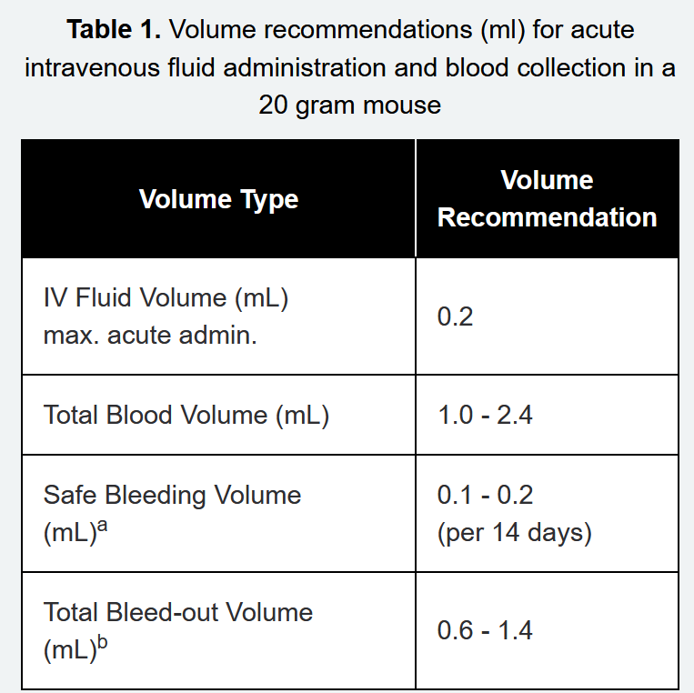

- EHS Animal worker training
	- Did this one a while ago
- All Personnel IACUC
	- lots of info, but most of it is IACUC related and not something I actually have to know now I think?
	- Compliance and whatnot
- Intro to Mice
	- Bunch of not useful things
	- Mouse housing
		- shoebox style cage with ventiliation
		- bedding material is for nesting and burrowing enrichment
		- Individually ventilated cages can be changes at longer intervals because they have mechanical ventilation
	- Have to acclimate and/or quarantine your mice when they first arrive
		- approved vendors can skip but generally this isn't the case
	- Mouse Grimace Scale to identify mouse pain level
		- It's fairly obvious when they're in severe distress, but not so much for moderate
		- chronic is also hard to tell
	- Inbred strains have identical genetics
	- Outbred have better kids but have genetic variability
	- Anatomical specifics
	  collapsed:: true
		- May develop red coloring around eyes and nostrils due to porphyrins from the Harderian gland
			- Accumulation happens in distressed or sick conditions
		- Jaw misalignment and tooth overgrowth can happen
		- Mice can't vomit
		- Do have a gallbladder though
		- Mice eat their feces because microorganisms in cecum break down plant matter
		- Mice are albino because of a defect in tyrosinase, and this also causes issues with neurons so they behave differently
		- High metabolism = fast drug clearance
		- Vulnerable to hypothermia during sedation because they have a high surface area
		- 
			- 25-29 gauge needle for blood collection
			- Typically inject and collect blood from the facial vein, but there are other options
			- 25-27 gauge needle for injection
				- Larger volumes ok for intraperitoneal or subcutaneous injection, otherwise have to limit to pretty small
	- Monoclonal antibodies can be made from hybridoma cells in the peritoneal lining
		- Need to prove that you have to use animal hybridomas and not an in vitro method to make your antibody
		- carefully consider all steps of in vivo method
	- Adjuvants
	  collapsed:: true
		- Freund's adjuvant is the most commonly used one
			- Complete has killed tuberculosis and gets very strong immune response
				- Can only use this once because it's too strong
			- Incomplete just has oils and water and can be used repeatedly
		- limit adjuvant as much as possible, as with anything else
		- CFA is a spooky human health hazard
		- There's a bunch of alternatives that are less scary
		- subcutaneous route is recommended
	- Analgesics, Sedatives, and Anesthetics
	  collapsed:: true
		- Dosage for mice may be comparatively higher than for humans because of fast metabolism
		- several options for analgesics (opiods or nsaids)
			- buprenorphine, lidocaine, carprofen, meloxicam
		- Sedatives
			- Midazolam and zolazepam, usually mixed with another drug
			- Medetomedine and xylazine are sedatives with analgesic effect
		- Anesthetics
			- isoflurane is the recommended gaseous one
			- Injectable is easier, usually ketamine 70-100 mg/kg + xylazine 10-20 mg/kg injected intraperitoneally
	- Surgery should be aseptic and done in a specific place
		- test with toe pinch to see if anesthesia is working
		- should withdraw as a reflex
	-