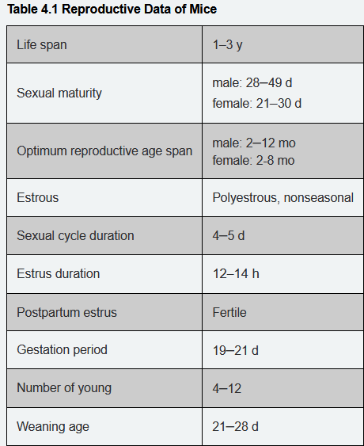
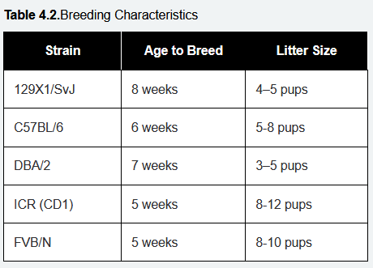
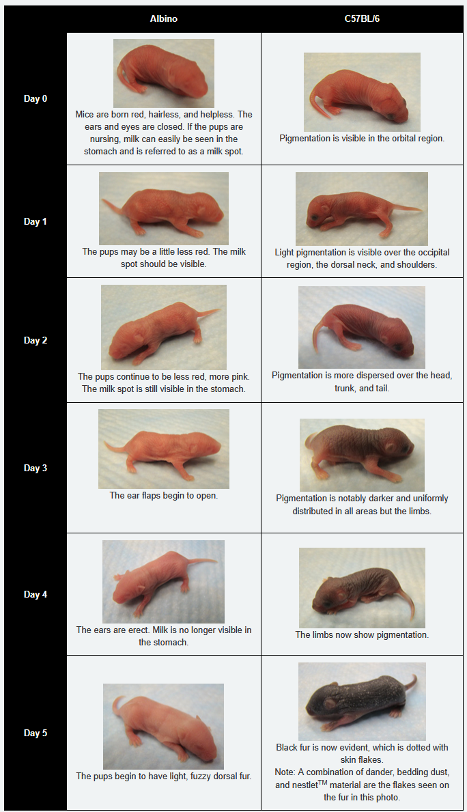
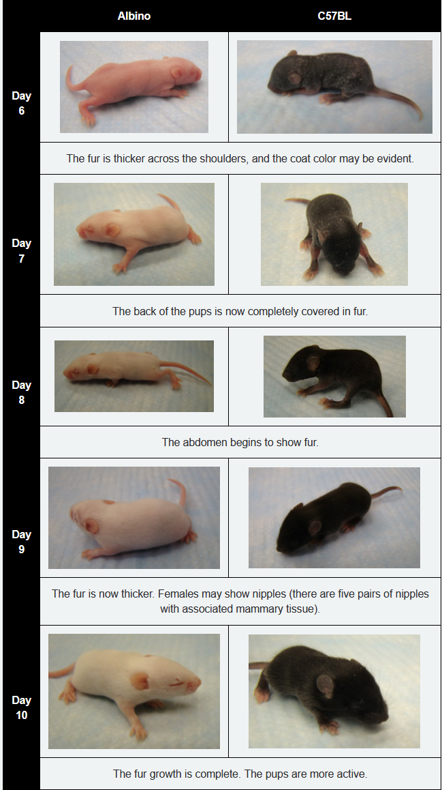
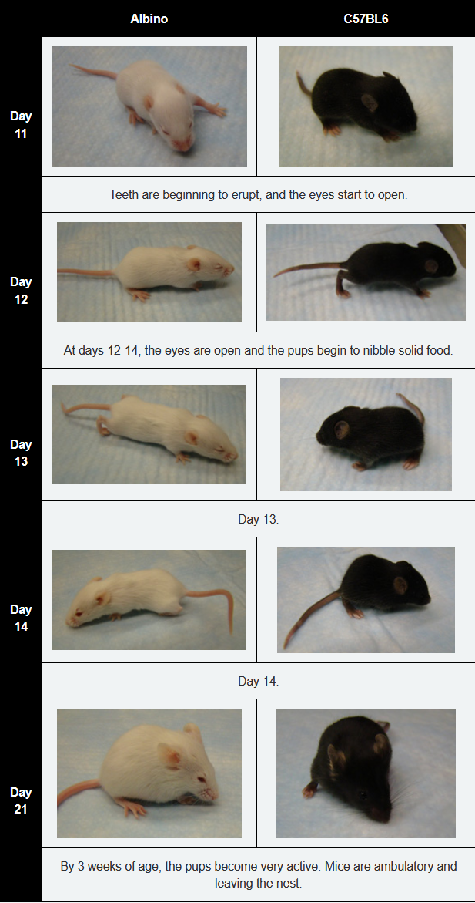

- Have to select good breeders and try to maximize efficiency
- Breeding contract to show how many mice you think you need in the colony
- intensive breeding has male with two or three females
	- maximize litters
	- postpartum estrus
	- have to move females out when they're pregnant to avoid OC
- nonintensive is single pair
	- stay together all the time, just wean the pups
- Have to consider fighting and what the strain does with pups
- Timed matings
	- set up plugs in afternoon, check for plug in the morning
- Mouse life data
	- 
- Sexual maturity for males is 4-7 weeks, 3-4 weeks for females
- 18 month old mouse is geriatric
- Most mice can have 6-7 litters in their life, pup number drops off after that
- C57BL/6J mice are notorious for losing their first litters
- Should mate as early as possible, before 4 months for sure
- Mating pair should be around the same size and healthy
- Sex mice by anogenital distance, males are greater
- Strain specific info
	- 
- Recording DOB on breeding cage is critical so that you don't lose your cages all at the same time
- Females can be brought into estrus by exposing them to male pheromones, which can be done by adding dirty bedding from a male’s cage to the females’ cage
- **Bruce Effect: **Introduction of a strange male within 24 hours of mating prevents implantation in bred females and estrus occurs in about 4 days. Females that are already pregnant when the male is introduced may spontaneously abort. This phenomenon occurs in wild mice, outbred mice, and in some inbred strains.
- Breeder diet is high fat
- nesting is good for breeding
- presence of a plug is not a guarantee that the mouse is actually pregnant
- Gotta check for pregnancy even with plugs bc you can miss or they can not plug
- Less handing of cage after delivery the better
- Neonate staging
  collapsed:: true
	- 
	- 
	- 
- Usually wean at 21 days
	- Need to do this before a new litter comes
	- Add some material from parent cage to the weaning cage
	- separate by sex at this point
- Problems can be caused by lots of things
	- check light cycle (14:10 is recommended, 12:12 is often used)
	- noise, vibration, location in rack, temp, humidity, etc
	- Check that you actually have a male and female in the cage
	- Generally better to rotate females than males
	- Sometimes males are just bad /shrug
	- Bunch of options for what happens if mother cannibalizes
	- Trace back everything about weanlings if they aren't the expected phenotype/genotype
- Sometimes you have to foster if the litter is valuable and mom isn't taking care of them
-