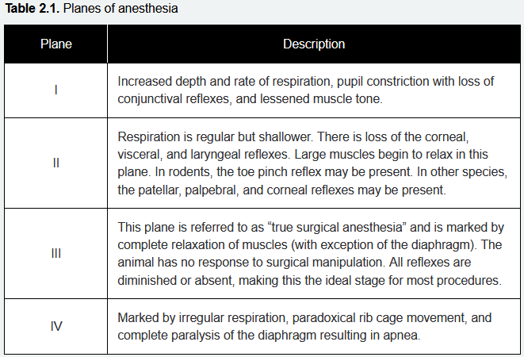
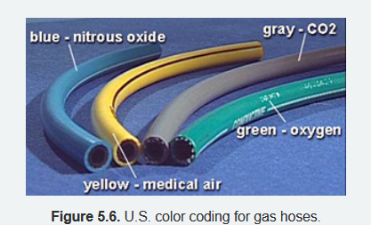

- It is important to use the lowest possible dose required to achieve a proper plane of anesthesia
- in combination with oxygen as the carrier gas, from an oxygen concentrator
- Planes of anesthesia
	- 
- endotracheal intubation, anesthesia may be induced with a combination of a preanesthetic (e.g., xylazine) and a short-term injectable anesthetic (e.g., ketamine/midazolam) or solely with an inhalant anesthetic
- faster rate of anesthetic induction caused by the other gas is known as the second gas effect
- agent that is water-soluble will dissolve to a high concentration in the blood
- agent that is fat-soluble quickly reaches saturation
- 
- flow meter adjusts the ~50 psi into a flow measured in liters per minute (L/min)
-