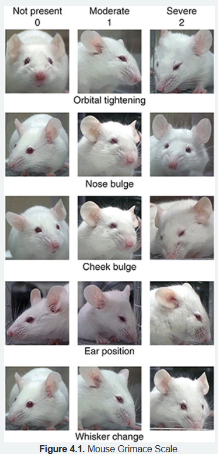

- 1st order neuron begins in the periphery and projects to a 2nd order neuron, which resides in the dorsal horn of the spinal cord
- 2nd order neuron ascends in the spinal cord and terminates in the thalamus, where it synapses with a 3rd order neuron
- 3rd order neuron projects to the cerebral cortex and other higher brain structures
- Agents that target perception include opioids, sedatives, alpha-2 receptor agonists and general anesthetics
	- agents that target other steps in this pathway are required to produce acceptable analgesia
- Agents that target transduction include local anesthetics, non-steroidal anti-inflammatory drugs (NSAIDs), and opioids
- Untreated pain causes immediate changes in the neurohormonal axis
- changes in locomotion, weight and food/water consumption are important components
- Potential symptoms
	- Squeaks, squeals
	- Hunched posture, rounded/rigid back; presses abdomen to cage floor; head tilts; squinted eyes; heeks bulge
	- Ataxia; runs in circles
	- Docile to aggressive; eats neonates
- Pain should be assessed, and results recorded each time the animal is monitored
- 
- scales are more effective when used in conjunction with scoring systems based on criteria for behavior and appearance
- LAs should be used as often as possible with every surgical procedure
- PLATTER - PLan, Anticipate, TreaT, Evaluate, Return
- Using combinations of analgesics from different classes with distinct mechanisms of action, results in synergistic effects
- preemptive analgesia can decrease the intensity and duration of postoperative pain
- Records must be kept on pain assessment, analgesic administration, and treatment outcome