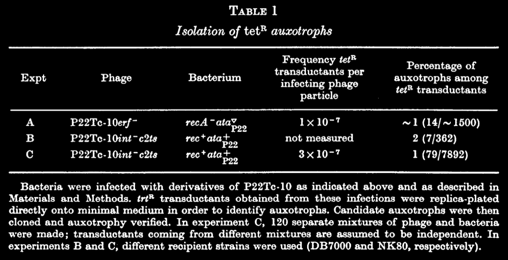

tags:: [[Chromosome Aberrations]], [[Chromosome Mapping]], [[Drug Resistance]], [[Gene Frequency]], [[Nucleic Acid Conformation]], [[Salmonella Phages]]
date:: [[Oct 5th, 1975]]
issn:: 0022-2836
issue:: 4
extra:: PMID: 1102715
doi:: 10.1016/s0022-2836(75)80059-3
title:: Mutagenesis by insertion of a drug-resistance element carrying an inverted repetition
pages:: 561-575
volume:: 97
item-type:: [[journalArticle]]
original-title:: Mutagenesis by insertion of a drug-resistance element carrying an inverted repetition
language:: eng
publication-title:: Journal of Molecular Biology
journal-abbreviation:: J Mol Biol
authors:: [[N. Kleckner]], [[R. K. Chan]], [[B. K. Tye]], [[D. Botstein]]
library-catalog:: PubMed
links:: [Local library](zotero://select/library/items/NYX9NGTI), [Web library](https://www.zotero.org/users/6106196/items/NYX9NGTI)

- Attachments
	- [PDF](zotero://select/library/items/ATWWVSWC) {{zotero-imported-file ATWWVSWC, "Kleckner et al. - 1975 - Mutagenesis by insertion of a drug-resistance element carrying an inverted repetition.pdf"}}
	- [PubMed entry](http://www.ncbi.nlm.nih.gov/pubmed/1102715)
- R elements are now called transposons
- tet resistance available on a translocalizable element
- Introduction
	- Using P22
	- 8.3kb insertion with weird structure
		- double stranded stem
			- flanking inverted insertion sequences
	- No loss of DNA when the insertion happens
	- This is not an example of specialized transduction
		- Not at the phage attachment site
	- Can go from one DNA molecule to another
- Materials and Methods
	- The antibiotic resistant phages can't fit all of their DNA into a phage head
		- bro got too big
		- Maintained as lysogens and are defective to single infection
			- Done with a temp sensitive
			- needs helper phage
	- integration mutant to study generalized transduction
- Results
	- DNA heteroduplexes between independent phages
		- DNA was denatured and reannealed
		- Can contain one stand from each of the two phages
		- Insertions in Tc-10 and Tc-106 are indistinguishable
			- Only difference is location on the P22 genome
		- Evidence to show that the insertions really are actually homologous
			- self complementarity is slightly obstructed by sterics
		- branch migration?
			- oh it's crossing over
	- Mutagenesis of Salmonella by insertion of the tetR element
		- Translocation of the material from R-factor to P22 genome did not impact integrity
		- It's also capable of going from P22 into the Salmonella genome
		- Even if you remove phage and bacterial recombination function, tetR can transfer
			- 
			- recA- bacteria and erf- phage can't do recombination
			- integration is also not needed
			- c2ts is a repressor mutant
				- would kill the bacteria even if it was able to integrate
		- Look for mutation caused by the insertion sequence jumping to salmonella
			- Screen tetR transductants for auxotrophs that came from that mutation
			- ~1% are auxotrophs
			- No specificity in the required nutrient
			- If you transfer the tetR from an auxotrophic bacteria via P22 generalized transduction, the transductant will be auxotrophic for the same thing as the donor
				- Doesn't matter what it is and it's every time (523/523)
			- Reversion to prototrophy is always accompanied by loss of tet resistance
	- Polarity of tetR insertions in histidine operon
		- They found 16 his- auxotrophs, use those to locate
		- Use complementation for individual genes to see if there's any polarity / pleiotropy
			- If you can't get complemented by one gene, the insertion is causing polarity in the operon
		- His operon has multiple promoters so polarity is limited to the next available promoter
		- Use deletion mapping to exactly place the insertions, and it all lines up
		- Can also check by using the biochemical pathway intermediates, and that also works
- Discussion
	-