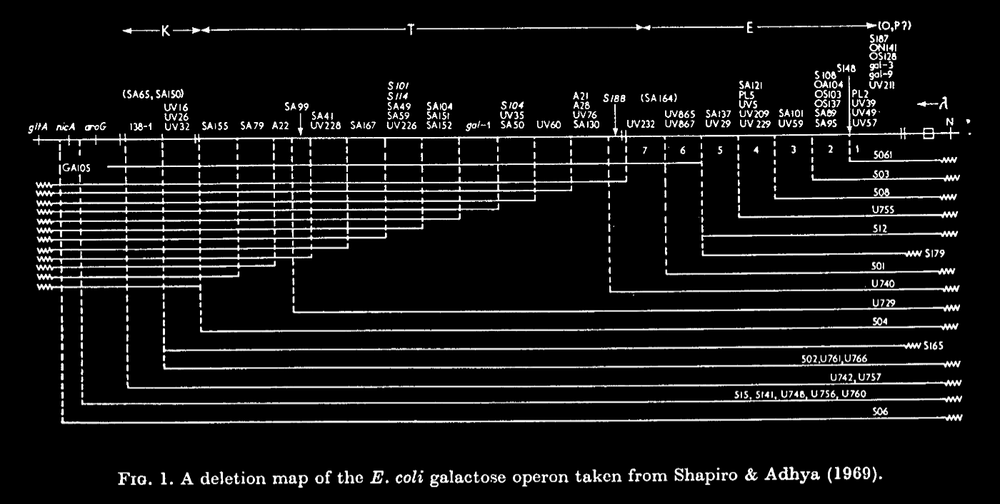
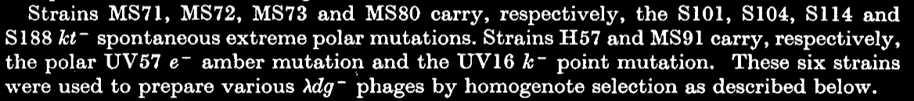
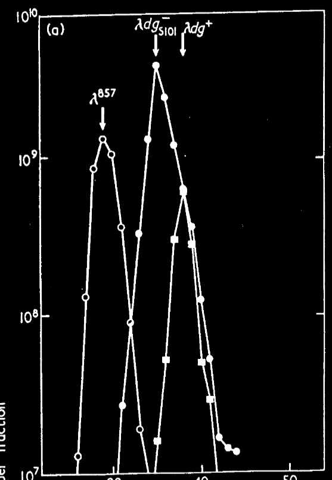

tags:: [[Centrifugation]], [[Density Gradient]], [[Chromosome Mapping]], [[Chromosomes]], [[Bacterial]], [[Coliphages]], [[DNA]], [[Viral]], [[Escherichia coli]], [[Galactose]], [[Lysogeny]], [[Mutation]], [[Operon]], [[Transduction]], [[Genetic]]
date:: [[Feb 28th, 1969]]
issn:: 0022-2836
issue:: 1
extra:: PMID: 4903362
doi:: 10.1016/0022-2836(69)90298-8
title:: Mutations caused by the insertion of genetic material into the galactose operon of Escherichia coli
pages:: 93-105
volume:: 40
item-type:: [[journalArticle]]
original-title:: Mutations caused by the insertion of genetic material into the galactose operon of Escherichia coli
language:: eng
publication-title:: Journal of Molecular Biology
journal-abbreviation:: J Mol Biol
authors:: [[J. A. Shapiro]]
library-catalog:: PubMed
links:: [Local library](zotero://select/library/items/QR4VB3RP), [Web library](https://www.zotero.org/users/6106196/items/QR4VB3RP)

- Attachments
	- [PDF](zotero://select/library/items/5W7TN9PP) {{zotero-imported-file 5W7TN9PP, "Shapiro - 1969 - Mutations caused by the insertion of genetic material into the galactose operon of Escherichia coli.PDF"}}
	- [PubMed entry](http://www.ncbi.nlm.nih.gov/pubmed/4903362)
- Spontaneous extreme polar mutations?
	- Oh polar like polarity
	- So this is a very early halting of transcription in an operon
		- Because operon is a string of genes that all get transcribed and translated together
- Introduction
	- Class of spontaneous extreme polar mutation of the galactose operon which are not base substitutions, frameshifts, or deletions
	- Forward selection for *gal-* mutations
	- Hypothesis is that this is an insertion
	- Polarity
		- Random insertion has a high probability of being out of reading frame or inverted
		- Ribosome almost certainly encounters a nonsense codon and early stops
		- Not sure what is meant by the strength of polarity
			- Furthermore, the position of the nonsense mutation within the upstream gene modulates the "degree of polarity", with nonsense mutations at the start of the upstream genes exerting stronger polarity (more reduced transcription) on downstream genes.
			- From [wikipedia](https://en.wikipedia.org/wiki/Transcription-translation_coupling#Polarity)
	- Genetic properties
		- Insertion mutations are not suppressible by extra or intragenic
		- Deletion or recombination are the only way
		- But probably just really hard to revert in any case
		- Hypothetically would  behave as a point mutation in a cross
		- \lambda\dg is a defective lambda phage that carries gal
			- This should float if it has more DNA (or just be more bouyant)
		- Measure buoyant density of phages and the insertions have more DNA
- Materials and Methods
	- 
		- genetic map of the locus
		- S with arrow is the insertion locations
	- Bacteria and phages
		- All K12 strains are gal-
		- 
		- Refer back to this later
		- MS71, MS72, MS73, MS80 are the insertions
		- H57 is UV57 e- amber mutation
			- This is very early, probably important
		- MS91 is UV16 k- point mutation
			- This is late
		- \lambda 857 has a mutant temperature sensitive cI, induced by high temp to lyse
	- Orgy technique
		- Low frequency transducing \lambda857 at high MOI searching for transductants at permissive temp
			- plated on galactose agar so only clones that are gal+ grow
			- These are all double lysogens
		- Resuspended in liquid and induced (high temp?) to get the lysate of all the mutants
		- Gradient in CsCl
			- This one I don't really get but I understand that there is a difference and that's more important
	- Verify that all transductants are double by infecting with \lambda vir that kills everything but not lysogens for \lambda
	- there's more but whatever
- Results
	- ~6kb difference between lambda 857 and lambda dg+
		- This is probably because the defective phage lost more phage DNA than it gained in gal
	- Homogenote formation does not cause a difference in density of the phage
		- could be that there is a difference in the DNA packaging, but there isn't
	- Figure 4 is the crux of the paper
		- 
			- This is one panel but it gets the point across
			- The phage that has the insertion mutation added to it is denser than the one that just has gal
			- There is more DNA in it
			- 
				- how to tell them apart
- Insertions are on the order of 1-2kb
- Most of this paper is control experiments to make sure that what they're seeing isn't because of a property of the mutant or of the centrifugation or the homogenate production
- Insertions might be very common