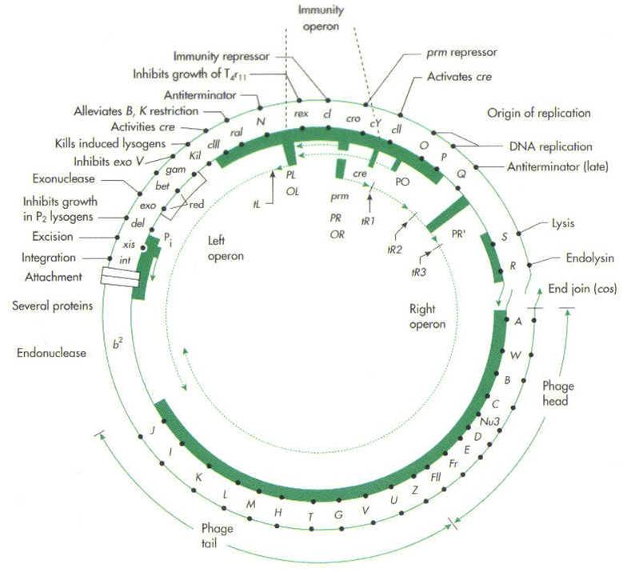

tags:: [[Coliphages]], [[Deoxyribonucleases]], [[Genes]], [[Regulator]], [[Lysogeny]], [[Mutation]], [[Operon]]
date:: 1970-07
issn:: 0027-8424
issue:: 3
doi:: 10.1073/pnas.66.3.855
title:: Regulation of repressor expression in lambda
pages:: 855-862
volume:: 66
item-type:: [[journalArticle]]
original-title:: Regulation of repressor expression in lambda
language:: eng
publication-title:: Proceedings of the National Academy of Sciences of the United States of America
journal-abbreviation:: Proc Natl Acad Sci U S A
authors:: [[H. Eisen]], [[P. Brachet]], [[L. Pereira da Silva]], [[F. Jacob]]
library-catalog:: PubMed
links:: [Local library](zotero://select/library/items/NAQFJ2HG), [Web library](https://www.zotero.org/users/6106196/items/NAQFJ2HG)

- [[Abstract]]
	- A new gene in bacteriophage lambda is described. The product of this gene cro prevents expression of immunity and regulates the expression of those genes to the left of the immunity region. cro(-) mutants have been isolated and characterized.
- Attachments
	- [PDF](zotero://select/library/items/R3IYHZTH) {{zotero-imported-file R3IYHZTH, "Eisen et al. - 1970 - Regulation of repressor expression in lambda.pdf"}}
	- [PubMed entry](http://www.ncbi.nlm.nih.gov/pubmed/5269249)
- cro is a new gene in \lambda that regulates expression of immunity repression
- Introduction
	- cI gene is located between the two operons controlled by the repressor and is transcribed from the same strand as the N operon
	- {:height 695, :width 748}
		- ((68d09833-ba1a-4b0b-aa4e-c4bc652ed74c))
		- Figure above helps to understand this
		- So what they're interested in is
			- N defective \lambda857 doesn't synthesize repressor at 40C
				- remains sensitive at 30
			- but ones that don't translate in front of it
		- Immunity operon is between rex and cY
		- Something is going on depending on where transcription is, it can or can't make c1
- Materials and Methods
	- Partial diploids
	- bunch of lysogens
- Failure to recover immunity is dominant
	- ((68d09e07-9329-4975-8ea3-03b50106f886))
		- mutant in N gene and contain 857 mutation in C1
		- One had a mutation in P_R, other in gene O
	- Double lysogens do not recover immunity
	- ((68d09f71-3d9c-4d27-ba6a-a1538605eb53))
		- cro gene
- The repressor regulator is specific for immunity
	- lambda repressor is specific for lambda and doesn't work with any other phages
		- is this also true for the regulator?
	- Double lysogens for different phage immunities were constructed
	-