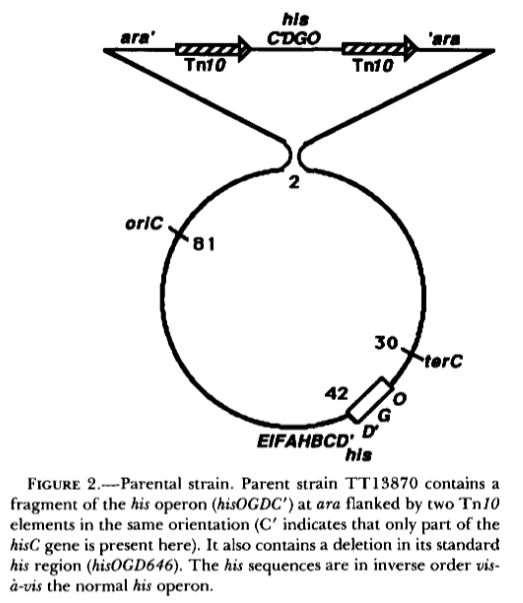
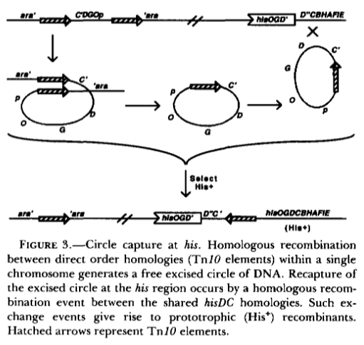
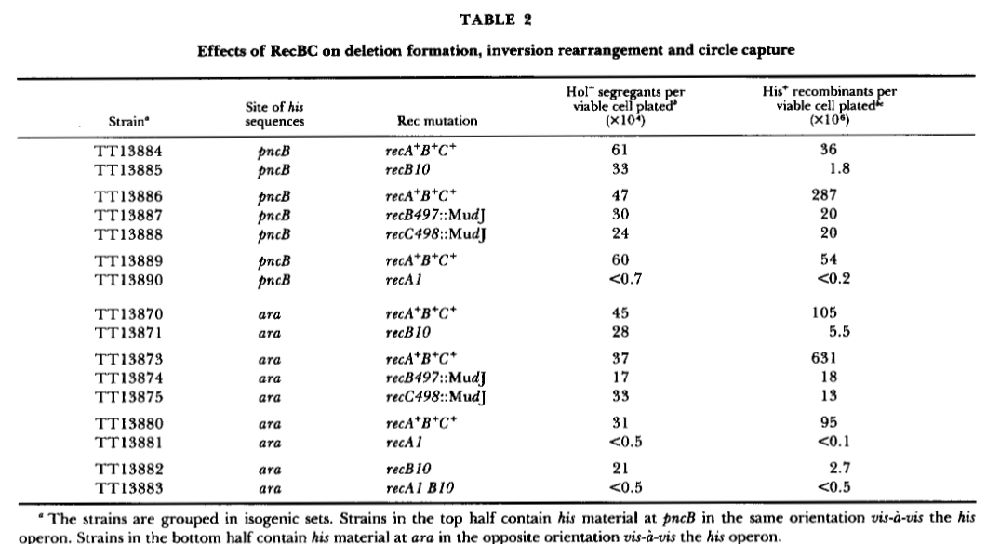

date:: [[Mar 1st, 1989]]
issn:: 1943-2631
issue:: 3
doi:: 10.1093/genetics/121.3.433
title:: Role of recBC function in formation of chromosomal rearrangements: a two-step model for recombination.
pages:: 433-443
volume:: 121
item-type:: [[journalArticle]]
access-date:: 2025-09-04T20:52:34Z
rights:: https://academic.oup.com/journals/pages/open_access/funder_policies/chorus/standard_publication_model
original-title:: Role of recBC function in formation of chromosomal rearrangements: a two-step model for recombination.
language:: en
url:: https://academic.oup.com/genetics/article/121/3/433/5997894
short-title:: Role of recBC function in formation of chromosomal rearrangements
publication-title:: Genetics
authors:: [[M J Mahan]], [[J R Roth]]
library-catalog:: DOI.org (Crossref)
links:: [Local library](zotero://select/library/items/8XDDI5YD), [Web library](https://www.zotero.org/users/6106196/items/8XDDI5YD)

- [[Abstract]]
	- The role of recBC functions has been tested for threetypes ofchromosomal recombination events: (1) recombination between direct repeats to generate a deletion, (2) recombination between a small circular fragment and thechromosome, and (3) recombination between inversely oriented repeats to form an inversion. Deletion formation by recombination between direct repeats, which does not require afully reciprocal exchange, is independent of recBC function. Circle integration and inversion formation are both stimulated by the recBC function; these events require full reciprocality. The results suggest that half-reciprocal exchanges can occur without recBC, but recBC functions greatly stimulate completion of a fully reciprocal exchange. We propose that chromosomal recombination is a two-step process,and recBC functions are primarily required for thesecond step.
- Attachments
	- [PDF](zotero://select/library/items/DYNVL343) {{zotero-imported-file DYNVL343, "Mahan and Roth - 1989 - Role of recBC function in formation of chromosomal rearrangements a two-step model for recombinatio.pdf"}}
- recBC gene product is ExoV nuclease
	- in vitro data shows that double stranded ends are the major substrate
- use circular constructs to see what happens
	- These don't have double stranded ends to begin with
	- If double stranded ends are a requirement, then RecBC dependence of recombination would suggest that double stranded ends are intermediates at some point
- They test for
	- recombination between direct repeats (deletion formation)
	- chromosomal integration of a circular by product
	- Inversion rearrangement
- Materials and Methods
	- MudJ insertions into recB and recC?
	- Hol- is histidinol
		- They're using His-and Hol- to compare parts of the his operon function
	- 43hr of incubation chosen? what the hell
	- Transposon at *ara* in TT13870
		- this can excise *his* material?
		- I guess the element between the IS elements has part of the his operon?
		- This section seems important
		- 
			- Ok they did not say this in the text lmao
			- inverse order seems important
		- 
		- ok so it seems like the element between the Tn10 elements carries part of the his operon and they select for recombination and transposition into the his operon by selecting for His+
			- So you're getting some pretty tiny fraction of hits here?
			- Ah and it has to be a circle to recombine back into the operon because otherwise it won't have enough homology
				- At least according to them
	- Recombination of the transposon gives a His+ recombinant with a reversion of the element in ara
		- They can detect this because..... I'm not sure
		- Something about transduction repair would be low frequency?
		- Oh because it's kanamycin resistance determinant
			- I think that means that the MudJ is a deletion that lets it accept kanamycin resistance very easily?
		- Parental strain that gets transduced is Hol+ and Km resistant
- Results
	- C' indicates that only a part of C is present
	- parent strain is his- but Hol+ because it has functional hisD but no hisC
	- They have another strain that is the same except the construct is in the pncB locus and it's in the same orientation, not opposite to the regular operon
- Recombination between direct order homologies is recBC independent
	- parent becomes Hol- if the hisD inbetween Tn10s is removed
		- This is an intrachromosomal exchange to spit out a plasmid
		- Can also be interchromosomal where one gets a deletion and one gets a duplication, still Hol-
	- recA mutations abolish Hol- clones
	- recB or recC mutation have not much change of Hol- segregants
		- these are measured as percentages because these mutants are pretty bad at being alive
	- ((68ccc93a-0503-4b4c-8ba7-7f432a9dbc04))
		- I'm not sure what this means
- RecBC enzyme stimulates circle generation and capture
	- Also visible in table 2
	- 
		- So what I'm seeing here is that if you have a mutant in recA you get no Hol- and no His+
			- i.e. no recombination happens at all
			- This doesn't matter if the DNA is inverted or not
		- I'm not convinced that there's any difference between the inverted DNA and the non inverted?
			- Mutation in RecB10 gives a big reduction in His+ but that's true for both ara and pncB loci
		- I guess they compare the 287 in line 3 to lines 4 and 5 that have 20 for His+
		- so RecBC is important for both circle capture and inversion formation
- Check if it's reciprocal or half reciprocal recombination
	- Is half reciprocal even real?
	- I have no idea what they're talking about
	- recBC is mostly fully reciprocal, opposite to their expectations
-