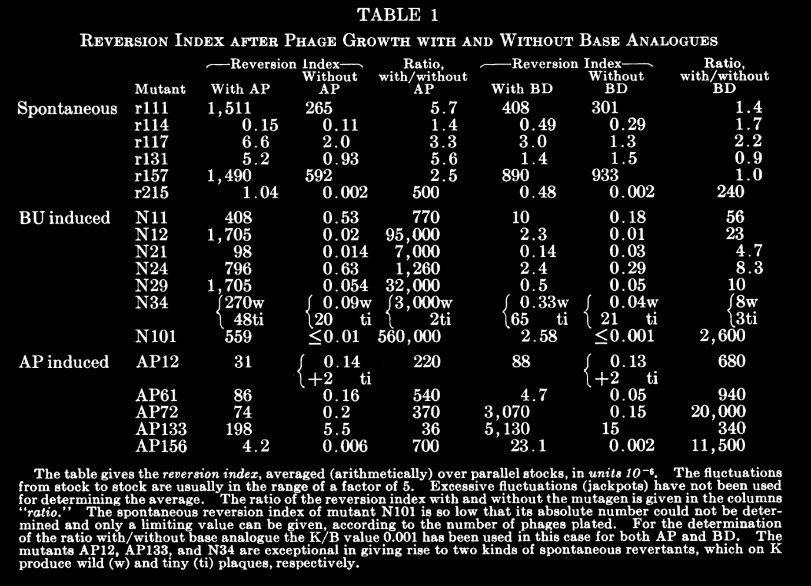

date:: 1959-04
issn:: 0027-8424
issue:: 4
doi:: 10.1073/pnas.45.4.622
title:: THE DIFFERENCE BETWEEN SPONTANEOUS AND BASE-ANALOGUE INDUCED MUTATIONS OF PHAGE T4
pages:: 622-633
volume:: 45
item-type:: [[journalArticle]]
original-title:: THE DIFFERENCE BETWEEN SPONTANEOUS AND BASE-ANALOGUE INDUCED MUTATIONS OF PHAGE T4
language:: eng
publication-title:: Proceedings of the National Academy of Sciences of the United States of America
journal-abbreviation:: Proc Natl Acad Sci U S A
authors:: [[E. Freese]]
library-catalog:: PubMed
links:: [Local library](zotero://select/library/items/4YF9745D), [Web library](https://www.zotero.org/users/6106196/items/4YF9745D)

- Attachments
	- [PDF](zotero://select/library/items/XFKZHRB6) {{zotero-imported-file XFKZHRB6, "Freese - 1959 - THE DIFFERENCE BETWEEN SPONTANEOUS AND BASE-ANALOGUE INDUCED MUTATIONS OF PHAGE T4.pdf"}}
	- [PubMed entry](http://www.ncbi.nlm.nih.gov/pubmed/16590424)
- Notes
- Induction of reverse mutations by base analogs 2-aminopurine (AP) and 5-bromo-deoxyuridine (BD)
- T4 mutants induced by these base analogs in the forward direction and cane be induced to revert
	- But proflavine induced and spontaneous mutants can't revert by the analogs
		- Only revert spontaneously
- rII phenotype
	- lack function necessary for phage growth in bacteria K, form r-plaques on bacteria B
	- I think bacteria K is E.coli K12
- T4 phage is lytic only
	- So mutants occur during the replication of the phage? During packaging and replication? Can't be incorporated into the bacterial genome
- Reversion Rates in Liquid Medium
	- rII revertants can be detected selectively by plating rII phages on bacteria K (E.coli K12)
		- Most cases plaques are wt (some exceptions)
			- double  mutants?
		- Basically your phage shouldn't be able to grow on K12, so if it does then you know that it's a revertant
	- Quantitative measurement you should use a small number of starting phage
		- This means that you have a small chance of introducing a revertant from the beginning? I think?
			- And if there is one then you'll detect it because you'll have a huge number of them
		- You want it to be rare
			- Because mutations don't happen all that often
	- So if you culture w/ and w/o the mutagen (base analogs) and compare amount of revertants then you can see how much of an effect it has
		- Reversion index is ratio of revertant to visible phages
		- Assay visible phages by growth on B
			- permissive condition, get total phage number
	- 
		-
- Method
  collapsed:: true
	- 400 phages added to 20mL growth media with 10^8 bacteria (B so the phage can grow)
	- Incubated for 24h
	- Plate out onto lawn of B and K do determine phage titer and revertant frequency
	- AP induction
		- Bacteria B-97 in H medium + 30ug/mL adenine, 500 ug/mL AP
		- H medium
			- Synthetic + 20 ug/mL histidine + 0.25 ug/mL thiamine
	- BD induction
		- Bacteria B-97 grown in F10 + 50 ug/mL BD
		- F10 medium
			- 1L H medium plus 20mg glycine & methionine; 10mg leucine, valine, serine, adenine sulfate, guanine sulfate, uracil; 0.2mg Ca pantothenate, pyridoxine; 10 ug Vitamin B12
		- Thymine is added and aminopterin for some reason
	-
-